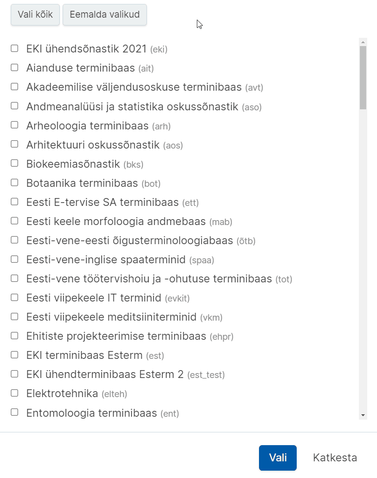
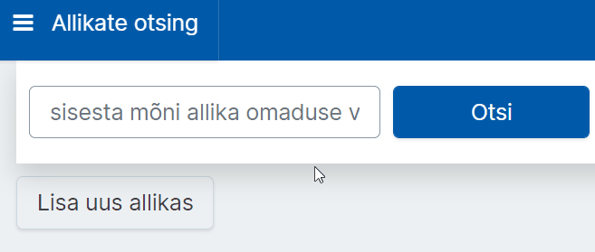
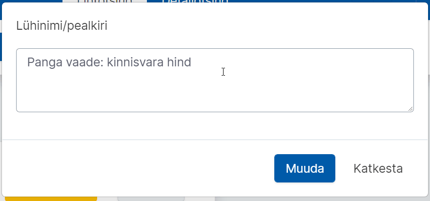

# Ekilexi kasutusjuhend

<button>[Avaleht](/index.md)</button>
<button>[Terminitöö sõnakoguga](/terminitoo.md)</button>
<button>[Allikad](/allikad.md)</button>

## Allikad

### Sisukord
  - [Allikate otsing](#allikate-otsing)
  - [Allika loomine](#allika-loomine)
  - [Allika muutmine](#allika-muutmine)
  - [Allika kustutamine](#allika-kustutamine)

---

### Allikate otsing

Juba sisestatud allikate nägemiseks vali rakenduse menüüst „Allikate otsing“. 
Allikaid saab otsida ükskõik missuguse andmekategooria järgi, nt pealkiri, autor, ISBN, ISSN, väljaandja vm.

Vaikimisi avaneb lihtotsing, kus otsikasti võib sisestada ükskõik missuguse andmekategooria.
Siin on väga soovitav kasutada metamärke, nt lisades otsisõna ette ja taha „\*“. 

#### Konkreetse allika viited mõistekirjades

Ekilexis on võimalik näha, millistes mõistekirjetes olen allikakirjet kasutanud ehk sellele viidanud. Selleks peaks:

1. vajutama allikakirje paremast nurgast nupule **“Otsi viiteid”**,
2. vajutama avanenud rippmenüüst **“Term otsing”**.

Pilt: Allika viidete otsimine

Seejärel avaneb terminoloogide vaates (seal, kus tavaliselt mõistekirjeid luuakse ja otsitakse) **loetelu kirjetest, kus allikale viidatud on**.

**NB!** Kui tahate tulemustes näha enda terminibaasi kirjeid, peate kindlasti terminoloogide vaate **valitud sõnakogude valikus olema enne märkinud enda terminibaasi**.

**Näide:** soovin näha tulemusi EKI ühendterminibaasi Esterm 2 kohta. Seega veendun, et juba enne allikakirjete juurde minemist on valitud sõnakogudest Esterm 2 valitud. Vaata allolevatelt animatsioonidelt, kuidas sõnakogusid valida.   

Pilt: Sõnakogude valimine

Pilt: Kindla sõnakogu valimine

Kui õige sõnakogu on enne allikate otsingu tegemist valitud, siis näete pärast allikaviidete otsimist kõiki kirjeid, kus konkreetsele allikale viidatud on.

---

### Allika loomine


Video: Allikakirje loomine Ekilexis

NB! Enne uue allika lisamist võiksite teha allika nimega otsingu, et veenduda, ega sama allikakirjet pole juba lisatud.

- Allikakirjeid saab lisada valides rakenduse menüüst „Allikate otsing“ ja avanenud lehel vajutades **„Lisa uus allikas“**.

Pilt: Nupp "Lisa uus allikas"

- **Pealkiri** (allika nimi, SOURCE_NAME) on kirjaliku allika (näiteks raamatu) puhul harilikult selle pealkiri, aga selle võib vajadusel ka ise vabalt valida. Allika nimi kuvatakse ka allikaviitena mõiste kirjes.

- Kui allikal on väga pikk nimi ja seda on samas mõistekirjes vaja kasutada mitmes kohas, võib allikale leiutada mingi lühendi (**Lühinimi**) ja lisada see lühend ühe nimetusena (nt „WMO“), siis saab mõistekirjes kasutada lühendit ja see ei võta nii palju ruumi ekraanil.

Pilt: Lühinime väli on pildil näidatud punase kastiga

- Allika **tüübiks** tuleks kirjaliku allika puhul valida Dokument.

- Alumises kastis saab allikale lisada muid informatiivseid välju (atribuute), näiteks vaikimisi on seal valitud autor. Kui raamatul on mitu autorit, võib iga ühe jaoks luua eraldi välja, aga pole ka probleemi, kui nad pannakse komadega eraldatult samale väljale. Samale väljale pannakse vajadusel ka autori tüüp, nt „koostanud Juhan Juurikas“ või „toimetanud J. Tatikas“.

- Vajutades rohelisele „+“ nupule saab allikale lisada veel uusi välju. Samuti saab allikale välju lisada hiljem, kui allikas on juba loodud. Saab ka eemaldada välju punase „-“ nupuga.
<!--siia võiks äkki väikese png-ga lisada nupu pildid?-->

- Ühel allikal võib olla ka mitu nime, näiteks pealkiri erinevates keeltes. Nimesid saab juurde lisada nii, nagu ka muid allika välju (valides välja tüübiks Lühinimi/pealkiri). 

- Vajutage nuppu **“Lisa”**.

---

### Allika muutmine

Allika muutmine tähendab siis sisuliselt allikakirje mõne välja ehk allika atribuudi lisamist/muutmist/kustutamist.

- Vali rakenduse menüüst „Allikate otsing“.
- Atribuudi lisamiseks:
  - Otsi allikas, mida tahad muuta.
  - Vajuta rohelisele „+“ nupule. Avaneb atribuudi lisamise vorm.
  - Vali rippmenüüst atribuudi tüüp.
  - Sisesta all olevale väljale atribuudi väärtus.
  - Vajuta „Lisa“.
- Atribuudi muutmiseks:
  - Otsi allikas, mida tahad muuta.
  - Liigu hiire kursoriga välja peale, mida tahad muuta. Välja lõppu tekivad nupukesed.
  
  Pilt: Välja lõppu tekivad muutmis- ja kustutamisnupp
  - Vajuta sinisele nupukesele „Muuda“.
  - Avaneb välja muutmisvorm.
  - Muuda välja sisu, salvestamiseks vajuta „Muuda“.
  
  Pilt: Sisu lisamine ja salvestamine
- Atribuudi kustutamiseks:
  - Otsi allikas, mida tahad muuta.
  - Liigu hiire kursoriga välja peale, mida tahad muuta. Välja lõppu tekivad nupukesed.
  - Vajuta kollasele nupukesele „x“ („Kustuta“).
  - Küsitakse kustutamise kinnitust. Vajuta „Jah“.

---

### Allika kustutamine

Allikakirje kustutamiseks:
- Vali rakenduse menüüst „Allikate otsing“.
- Otsi allikas, mida tahad kustutada
- Vajuta kollasele nupule „Eemalda allikas“.

---

### Allika ühendamine ?