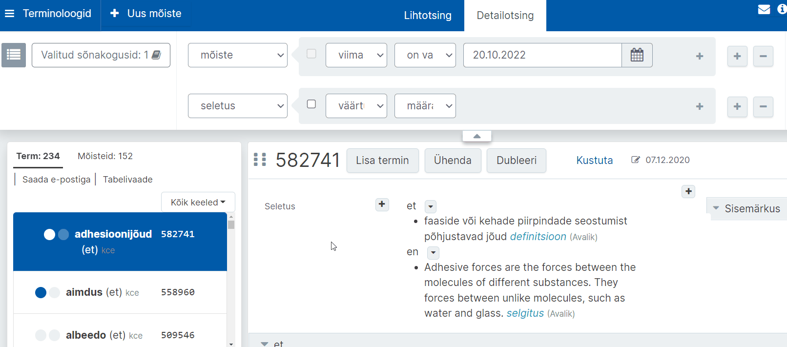

# Ekilexi kasutusjuhend

<button>[Avaleht](/index.md)</button>
<button>[Terminitöö sõnakoguga](/terminitoo.md)</button>
<button>[Allikad](/allikad.md)</button>

## Avaleht 

### Sisukord
- [Mis on Ekilex?](#mis-on-ekilex)
- [Kasutajaks registreerumine ja õiguste taotlemine](#kasutajaks-registreerumine-ja-õiguste-taotlemine)
- [Töölaud](#töölaud)
- [Terminite otsing](#terminite-otsing)
- [Uue sõnakogu loomine](#uue-sõnakogu-loomine)
  - [Sõnakogu muutmisõigused](#sõnakogu-muutmisõigused)
    
---

### Mis on Ekilex?

Ekilex on Eesti Keele Instituudi sõnastiku- ja terminibaasisüsteem. Ekilex asub aadressil [https://ekilex.ee/](https://ekilex.ee/) ja on kõigile, kes soovivad oma terminibaasi koostada, tasuta kasutatav. <!--röhkem täpsustavat infot?-->

---

### Kasutajaks registreerumine ja õiguste taotlemine

- Ekilexi kasutamiseks tuleb luua endale kasutajakonto. Selleks mine Ekilexi avalehele ja vajuta nuppu „Loo kasutaja“.
- Avaneb kasutajaks registreerumise vorm. Pead sisestama oma ees- ja perekonnanime, e-posti aadressi ja valima parooli, mille sisestad kaks korda. 
<!-- - Pead ka läbi lugema kasutustingimused ja kinnitama nendega nõusoleku.-->
- Seejärel klõpsa nupul „Registreeru“. 
- Mõne sekundi jooksul saadetakse sinu e-postkasti kinnituskiri. Kui kirja pole tulnud, vaata ka rämpsposti kataloogi või trüki otsingureale „Ekilexi kasutaja registreerimine“. Oma konto aktiveerimiseks pead klõpsama kinnituskirjas saadetud aktiveerimislingil.
- Pärast lingil klõpsamist avaneb Ekilexi sisselogimisvorm koos teatega „Kasutaja on aktiveeritud, head kasutamist“.
- Sisselogimiseks sisesta oma e-posti aadress ja eelnevalt valitud parool ning klõpsa nupul „Sisene“.
<!--Õiguste taotlemise lehte ei kontrollinud veel, kuna peaks uue kasutaja tegema-->
- Kui oled sisse loginud, avaneb õiguste taotlemise leht, kus on teade: „See on EKI sõnastiku- ja terminibaasisüsteem Ekilex. Siin saad esitada taotluse Ekilexi kasutamiseks vaatamisõigusega. Kui vaja, vali sõnakogud, millele soovid muutmisõigust.“
  + Vaatamisõiguse saamiseks vajuta lihtsalt „Hakka Ekilexi kasutama“. Selle valikuga saad ka muutmisõiguse „Katsebaasile“, kus saab katsetada andmete sisestamist.
  + Muutmisõiguste taotlemiseks olemasolevale sõnakogule: 
    - Vajuta „Soovin sõnakogude muutmisõigust“ ja vali soovitud sõnakogu(d), mille autorite hulka sa kuulud. Pole mõtet valida sõnakogusid, millega sul puudub seos.
    - Muutmisõiguse taotlemise korral vajuta ka „Soovin põhjendada taotlust“ ja kirjuta lahtrisse lühidalt, kuidas oled sõnakoguga seotud. Põhjendus on kohustuslik.
    - Seejärel vajuta „Saada taotlus“.
    - Nüüd tuleb oodata, kuni Ekilexi administraator annab sulle küsitud õigused. Selle kohta saadetakse e-kiri. Pärast seda saad hakata Ekilexi kasutama. Kui oled õiguste saamise hetkel (e-kirja saabumise hetkel) Ekilexi sisse logitud, pead kõigepealt välja logima ja siis uuesti sisse logima, selleks, et õigused rakenduksid.

---

### Töölaud

Pärast sisselogimist satub kasutaja töölauale. Töölauaks nimetame Ekilexi avalehte sisselogitud olekus, millele pääseb igalt lehelt, klõpsates vasakult ülanurgast avanevat rakenduse menüüd ja valides „Ekilex“. Töölaual on järgmised valikud.

- **Leksikograafid:** sõnapõhine vaade sõnakogudele, mõeldud tööks leksikograafidele
- **Terminoloogid:** mõistepõhine vaade sõnakogudele, mõeldud tööks terminoloogidele
- **Sünonüümid:**
- **Tõlkevasted:**
- **Allikate otsing:** allikate otsing, lisamine, muutmine, kustutamine
- **Võrgustiku otsing:** ?
- **Kustutatud andmed:** ?
- **Sõnakogude haldus:** kõigi Ekilexis leiduvate sõnakogude loend ja lisamine, muutmine, kustutamine
- **Sõnaveebi tagasiside:** võimalus lugeda Sõnaveeb.ee saidile jäetud tagasisidet
- **Sõnaveebi statistika:** ?
- **Vali roll:** rippmenüü rolli valikuks. Siin tuleb valida selle sõnakogu muutja roll, milles olevaid andmeid soovid muuta. Kasutaja saab samaaegselt muuta ainult ühe sõnakogu andmeid. Muutja rolli olemasolu eelduseks on vastava sõnakogu muutmise õigus. Õiguseid saab juurde taotleda kasutaja profiilis. <!--lisada link osale kus õpetatakse õiguste taotlemist profiilis-->

Terminitööks soovitame kasutada terminoloogide otsingut ehk terminoloogi vaadet.

---

### Terminite otsing

- Vajuta töölaual „Terminoloogid“.
- Avaneb terminoloogi vaade. Vajuta nuppu „Valitud sõnakogusid: 0“. Vali linnukestega sõnakogud, millest soovid otsida, ja vajuta „Vali“.
- Sisesta otsisõna. Kasutada võib metamärke: 
  - **?** = 1 suvaline tähemärk (nt kui otsid „m?iste“ siis leiad nt „mõiste“, „muiste“);
  - **\*** = 0 või rohkem suvalisi tähemärke. (nt kui otsid „\*hiir\*“, siis leiad nii „hiir“, „arvutihiir“, „hiirehernes“ kui „aedhiirehernes“.)
- Vajuta „Otsi“.
Täpsem Terminoloogide töökäigu juhend on [siin](#terminitöö-sõnakoguga).

#### Detailotsingu kriteeriumide peitmine

Ekilexis on detailotsing, mis võimaldab terminibaasist kindlate kriteeriumide alusel kirjeid leida. Et aga otsing tulemusi sirvides liiga palju ruumi ja tähelepanu ei nõuaks, on võimalik otsingukriteeriumid selleks ajaks peitu klõpsata.

- **Kriteeriume saab peita otsingukastide all paikneva noolekesega**. Et otsing taas avada, tuleks uuesti noolekesele klõpsata.
{: .shadow}

Pilt: Detailotsingu peitmine

#### Otsingutulemustes kindlale lehele minemine

Kui teete Ekilexis otsinguid, võib mõnikord tulla lehekülgede kaupa vastuseid. Et te ei peaks soovitud leheni jõudmiseks kõiki eelmisi lehti läbi vaatama, võite lahtri “Mine lehele” järele sisestada selle lehenumbri, kuhu soovite suunduda.

- **Lahter “Mine lehele” asub otsingutulemuste allosas.** Kui te seda kohe ei näe, püüdke leht alla kerida ning otsige lahtrit lehe vasakul pool asuvate tulemuste alläärest.
- Lehele suundumiseks **trükkige lahtrisse soovitud number** ning **vajutage klaviatuuril nuppu “Enter”**.

Pilt: Lehe all vasakul asuv lahter, kuhu saab lehe numbri sisestada

---

### Uue sõnakogu loomine

Klõpsa töölaual linki „Sõnakogude haldus“. Avaneb leht, millel on sõnakogude nimekiri. Vajuta üleval paremal nuppu „Lisa uus“. Avaneb uue sõnakogu loomise vorm.

- **Sõnakogu kood:** võimalikult lühike (3-10 märki) tähekombinatsioon, millest saab loodava sõnakogu identifikaator (lühitähis)
- **Nimi:** sõnakogu nimi
- **Tüüp:** kui lood terminibaasi, vali „terminibaas“, muul juhul „sõnakogu“
- **Kirjeldus ja kontaktid (Sõnaveebis nähtav):** sõnakogu lühikirjeldus, mida näidatakse Sõnaveebis
- **Lisainfo ja kontaktid (Sõnaveebis mitteavalik):** (kontakt)info, mis on nähtav teistele Ekilexi kasutajatele, kuid ei ole nähtav Sõnaveebis.
- **Sõnakogu pilt/logo:** 
- Juhul, kui soovid oma sõnakogu mõistetele lisada valdkonnamärgendeid:
  - **Valdkonna klassifikaatori päritolu:** vali valdkonna klassifikaatori kood. See võib olla mõne olemasoleva sõnakogu klassifikaator või iseseisev valdkonna klassifikaator (nt Lenoch, EKI üld). Oma klassifikaatori lisamiseks võta ühendust Ekilexi kasutajatoega.
  - **Valdkonnad:** Siin on loetelu eelnevalt valitud klassifikaatori kõikidest valdkondadest. Vali loetelust valdkonnamärgendid, mida soovid oma sõnakogus kasutada. Võib valida ükshaaval või vajutada „Vali kõik“.
- **Keeled:** vali keeled, mida soovid oma sõnakogus kasutada
- **Nähtav:** Ekilexis on sõnakogu info otsinguga leitav
- **Avalik:** sõnakogu on avalikustatud ja nähtav lõppkasutajale terminiveebis või sõnaveebis
- Kui vorm on täidetud, vajuta „Salvesta“

Sõnakogu on nüüd loodud ja ilmub sõnakogude nimistusse.

#### Sõnakogu muutmisõigused

Ekilexi kasutajal saab konkreetsele sõnakogule olla omaniku õigus, muutja õigus, vaataja õigus või mitte mingeid õigusi (viimasel juhul näeb kasutaja selles sõnakogus ainult avalikke termineid).
Kasutaja, kes lõi uue sõnakogu, saab selle omanikuõigused. Sõnakogu omanik saab lisaks sisu muumisele muuta ka sõnakogu seadeid ja metainfot, anda sõnakogu juurdepääsuõigusi teistele Ekilexi kasutajatele ja ka kustutada sõnakogu.

[Hakka pihta!](https://ekilex.eki.ee/)

Küsimuste korral kirjuta [kasutajatugi@ekilex.ee](mailto:kasutajatugi@ekilex.ee)!

Süsteemi alles arendatakse, mistõttu juhend täieneb.