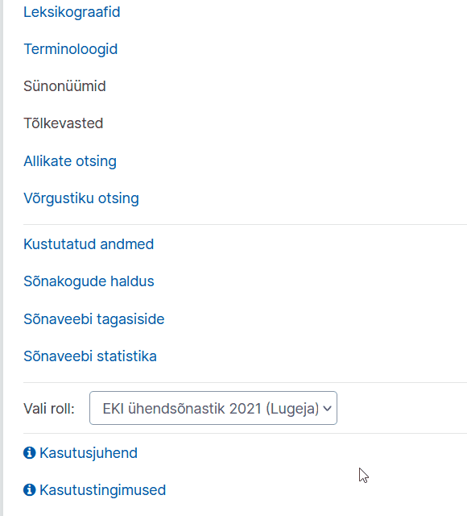
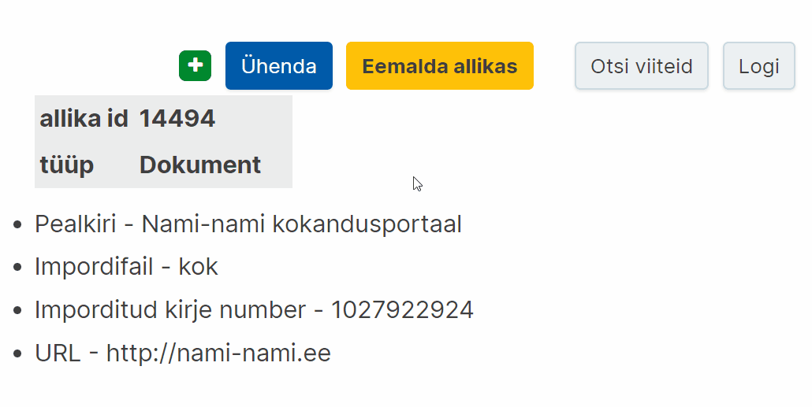
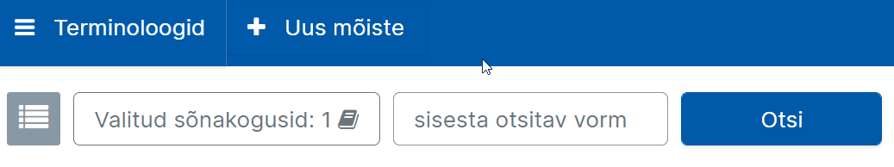

# Ekilexi kasutusjuhend

<button>[Avaleht](/index.md)</button>
<button>[Terminitöö sõnakoguga](/terminitoo.md)</button>

## Avaleht 

### Sisukord
- [Mis on Ekilex?](#mis-on-ekilex)
- [Kasutajaks registreerumine ja õiguste taotlemine](#kasutajaks-registreerumine-ja-õiguste-taotlemine)
  - [Terminibaasis muudatuste tegemine](#terminibaasis-muudatuste-tegemine)
- [Töölaud](#töölaud)
- [Katsetamine ja proovikirjete koostamine](#katsetamine-ja-proovikirjete-koostamine)
- [Kirjete muutmine pärast valmimist](#kirjete-muutmine-pärast-valmimist)
- [Uue sõnakogu loomine](#uue-sõnakogu-loomine)
  - [Sõnakogu muutmisõigused](#sõnakogu-muutmisõigused)
- [Allikad](#allikad)
  - [Allikate otsing](#allikate-otsing)
    - [Konkreetse allika viited mõistekirjades](#konkreetse-allika-viited-mõistekirjades)
    - [Kõikide terminibaasis viidatud allikate kuvamine](#kõikide-terminibaasis-viidatud-allikate-kuvamine)
  - [Allika loomine](#allika-loomine)
  - [Allika muutmine](#allika-muutmine)
  - [Allika kustutamine](#allika-kustutamine)
  - [Allika ühendamine ?](#allika-ühendamine)
- [Mõistekirja, termini või muu kirje osise lisaja kuvamine](#mõistekirja-termini-või-muu-kirje-osise-lisaja-kuvamine)
    
---

### Mis on Ekilex?

Ekilex on Eesti Keele Instituudi sõnastiku- ja terminibaasisüsteem. Ekilex asub aadressil [https://ekilex.ee/](https://ekilex.ee/) ja on kõigile, kes soovivad oma terminibaasi koostada, tasuta kasutatav. <!--rohkem täpsustavat infot?-->

---

### Kasutajaks registreerumine ja õiguste taotlemine

1. Ekilexi kasutamiseks tuleb luua endale **kasutajakonto**. Selleks mine Ekilexi avalehele ja vajuta nuppu „Loo kasutaja“.

2. Avaneb kasutajaks registreerumise vorm. Pead sisestama oma **ees- ja perekonnanime**, **e-posti aadressi** ja valima **parooli**, mille sisestad kaks korda. 

3. Pead ka läbi lugema **kasutustingimused** ja kinnitama nendega nõusoleku.

4. Seejärel klõpsa nupul **„Registreeru“**. 

5. Mõne sekundi jooksul saadetakse sinu e-postkasti **kinnituskiri**. Kui kirja pole tulnud, vaata ka rämpsposti kataloogi või trüki otsingureale „Ekilexi kasutaja registreerimine“. Oma konto aktiveerimiseks pead klõpsama kinnituskirjas saadetud **aktiveerimislingil**.

Pilt: Näide kasutaja registreerimise kinnituskirjast

6. Pärast lingil klõpsamist avaneb Ekilexi sisselogimisvorm koos teatega „Kasutaja on aktiveeritud, head kasutamist“.

7. Sisselogimiseks sisesta oma e-posti aadress ja eelnevalt valitud parool ning klõpsa nupul **„Sisene“**.

8. Kui oled sisse loginud, avaneb **õiguste taotlemise leht**, kus on teade: „See on EKI sõnastiku- ja terminibaasisüsteem Ekilex. Kui vaja, vali sõnakogud, millele soovid muutmisõigust.“

Pilt: Avaleht esimesel sisselogimisel

  + **Vaatamisõiguse** saamiseks vajuta lihtsalt „Hakka Ekilexi kasutama“. Selle valikuga saad ka muutmisõiguse „Katsebaasile“, kus saab katsetada andmete sisestamist.

  + **Muutmisõiguste** taotlemiseks olemasolevale sõnakogule: 
    1. Vajuta **„Soovin sõnakogude muutmisõigust“** ja vali soovitud sõnakogu(d), mille autorite hulka sa kuulud. Pole mõtet valida sõnakogusid, millega sul puudub seos.
    2. Muutmisõiguse taotlemise korral vajuta ka „Soovin põhjendada taotlust“ ja kirjuta lahtrisse lühidalt, kuidas oled sõnakoguga seotud. **Põhjendus on kohustuslik**.
    3. Seejärel vajuta **„Saada taotlus“**.
    4. Nüüd tuleb oodata, kuni Ekilexi administraator annab sulle küsitud õigused. **Selle kohta saadetakse e-kiri**. Pärast seda saad hakata Ekilexi kasutama. Kui oled õiguste saamise hetkel (e-kirja saabumise hetkel) Ekilexi sisse logitud, pead kõigepealt välja logima ja siis uuesti sisse logima, selleks, et õigused rakenduksid.

#### Terminibaasis muudatuste tegemine

Kui olete terminibaasi loonud, on teil õigused sinna mõistekirjeid lisada ja seal muid muudatusi teha. Kui näete, et ei saa oma terminibaasis muudatusi teha, võib probleem olla selles, et **valitud on vale sõnakogu muutja roll.**

Kõik Ekilexi kasutajad saavad liitudes katsebaasi muutmisõigused ehk katsebaasi muutja rolli. Kui luuakse uus terminibaas, on rolle, mille vahel valida, kaks. Kui te ei saa enda terminibaasis muutusi teha, on võimalik, et olete kogemata jäänud katsebaasi muutja rolli. **Enda rolli näeb ja saab muuta ülevalt sinise riba paremast nurgast oma nime alt. Peaksite sealt valima oma terminibaasi muutja rolli.**

1. Klõpsake üleval **sinise riba paremal pool** oma nimele
  
Pilt: Kasutajale klõpsamisel ilmuv rippmenüü

2. Kui soovite rolli vahetada, vajutage **“Vaheta”**.
  
Pilt: Klõpsake "Vaheta"

3. Klõpsake avanenud lehel kirja **“Vali roll”** järel olevale väljale ja **valige menüüst sobiv roll**.
 
Pilt: Rippmenüüst rolli valimine

Allikas: [link](https://terminoloogia.ee/ufaqs/miks-ma-ei-saa-enda-terminibaasis-muudatusi-teha/)

---

### Töölaud

Pärast sisselogimist satub kasutaja töölauale. Töölauaks nimetame Ekilexi avalehte sisselogitud olekus, millele pääseb igalt lehelt, klõpsates vasakult ülanurgast avanevat rakenduse menüüd ja valides „Ekilex“. Töölaual on järgmised valikud.

- **Leksikograafid:** sõnapõhine vaade sõnakogudele, mõeldud tööks leksikograafidele
- **Terminoloogid:** mõistepõhine vaade sõnakogudele, mõeldud tööks terminoloogidele
- **Sünonüümid:** ??
- **Tõlkevasted:**??
- **Allikate otsing:** allikate otsing, lisamine, muutmine, kustutamine
- **Võrgustiku otsing:** ??
- **Kustutatud andmed:** ??
- **Sõnakogude haldus:** kõigi Ekilexis leiduvate sõnakogude loend ja lisamine, muutmine, kustutamine
- **Sõnaveebi tagasiside:** võimalus lugeda Sõnaveeb.ee saidile jäetud tagasisidet
- **Sõnaveebi statistika:** ??
- **Vali roll:** rippmenüü rolli valikuks. Siin tuleb valida selle sõnakogu muutja roll, milles olevaid andmeid soovid muuta. Kasutaja saab samaaegselt muuta ainult ühe sõnakogu andmeid. Muutja rolli olemasolu eelduseks on vastava sõnakogu muutmise õigus. Õiguseid saab juurde taotleda kasutaja profiilis. <!--lisada link osale kus õpetatakse õiguste taotlemist profiilis-->

Terminitööks soovitame kasutada terminoloogide otsingut ehk terminoloogi vaadet. Selle kasutamise kohta on laiemalt kirjutatud [Terminitöö kasutusjuhendis](/terminitoo.md).

### Katsetamine ja proovikirjete koostamine

Ekilexis on üks terminibaas, mis ongi mõeldud katsetamiseks – **Katsebaas**. Katsebaasis võib mõistekirjeid luua igaüks olenemata sellest, mis valdkonna terminoloogiaga ta muidu töötab. Katsebaasi muutmisõigus on igal Ekilexi kasutajal ja seda ei pea eraldi taotlema. Katsebaasi kirjed ei muutu Sõnaveebis avalikuks ja jäävad alati vaid Ekilexi.

Selleks, et Katsebaasis kirjete koostamist katsetada, peaksite tegema läbi järgmised sammud:

<!-- kas siia peaks panema et 1. töölauale minemine? sest 2 step'i tegelt-->
1. Valima Ekilexis **Katsebaasi muutja rolli** (lugege rollidest ja nende vahetamisest lähemalt [siit](juhendi link)),
  
Pilt: Kasutaja alt "Vaheta" valimine
  
Pilt: Töölaual katsebaasi muutja rolli valimine

2. **Minema terminoloogide vaatesse** (töölaual “Terminoloogid”),
  
Pilt: Terminoloogide vaatesse minemine
<!-- selle jaoks uus gif?-->

3. Alustama mõistekirje loomist, vajutades nupule **“Uus mõiste”**. 

**NB!** On väga oluline, et pärast katsetamist, kui soovite hakata looma kirjeid enda terminibaasi, **vahetaksite Katsebaasi muutja rolli jälle enda terminibaasi muutja rolli vastu**. Muidu sisestate oma terminibaasi kirjed ekslikult Katsebaasi.

Rolli saab vahetada nii, nagu kirjeldatud 1. punktis, lihtsalt sel juhul peaks Katsebaasi muutja rolli asemel valima oma terminibaasi muutja/omaniku rolli.

---

### Kirjete muutmine pärast valmimist

**Ekilexis saab kõiki mõiste- ja allikakirje välju muuta ka pärast seda, kui olete kirjega enda hinnangul (selleks korraks) lõpetanud.**

Mõnikord võite soovida kirjet hiljem täiendada või avastate mõnel väljal näiteks trükivea. Isegi kui kirje on juba Sõnaveebis avalik, saate seda sellegipoolest Ekilexis parandada või täiendada. Järgmisel päeval on muudatus näha ka Sõnaveebis.

Ekilexis on iga välja **muutmisnupp sinine**. Muutmisnupp tekib, kui **lähete hiirekursoriga selle välja peale, mida soovite muuta**.

- Näide muutmisnupu klõpsamisest mõistekirjes:
  
Pilt: Hiirekursoriga väljadest üle liikumisel ilmuvad sinised muutmisnupud

- Näide muutmisnupu klõpsamisest allikakirjes:
  
Pilt: Hiirekursoriga väljadest üle liikumisel ilmuvad sinised muutmisnupud

Seejärel avaneb aken, kus saate soovitud muudatuse teha.

**NB! Muuta saab ainult neid kirjeid, mille olete kas ise loonud (allikakirjete puhul) või mis asuvad terminibaasis, mille muutmisõigus teil on (mõistekirjete puhul).** Enamasti on terminibaasi koostajatel õigus teha muudatusi vaid enda terminibaasi kirjetes.

---

### Uue sõnakogu loomine

Klõpsa töölaual linki „Sõnakogude haldus“. Avaneb leht, millel on sõnakogude nimekiri. Vajuta üleval paremal nuppu „Lisa uus“. Avaneb uue sõnakogu loomise vorm.

- **Sõnakogu kood:** võimalikult lühike (3-10 märki) tähekombinatsioon, millest saab loodava sõnakogu identifikaator (lühitähis)
- **Nimi:** sõnakogu nimi
- **Tüüp:** kui lood terminibaasi, vali „terminibaas“, muul juhul „sõnakogu“
- **Kirjeldus ja kontaktid (Sõnaveebis nähtav):** sõnakogu lühikirjeldus, mida näidatakse Sõnaveebis
- **Lisainfo ja kontaktid (Sõnaveebis mitteavalik):** (kontakt)info, mis on nähtav teistele Ekilexi kasutajatele, kuid ei ole nähtav Sõnaveebis.
- **Sõnakogu pilt/logo:** 
- Juhul, kui soovid oma sõnakogu mõistetele lisada valdkonnamärgendeid:
  - **Valdkonna klassifikaatori päritolu:** vali valdkonna klassifikaatori kood. See võib olla mõne olemasoleva sõnakogu klassifikaator või iseseisev valdkonna klassifikaator (nt Lenoch, EKI üld). Oma klassifikaatori lisamiseks võta ühendust Ekilexi kasutajatoega.
  - **Valdkonnad:** Siin on loetelu eelnevalt valitud klassifikaatori kõikidest valdkondadest. Vali loetelust valdkonnamärgendid, mida soovid oma sõnakogus kasutada. Võib valida ükshaaval või vajutada „Vali kõik“.
- **Keeled:** vali keeled, mida soovid oma sõnakogus kasutada
- **Nähtav:** Ekilexis on sõnakogu info otsinguga leitav
- **Avalik:** sõnakogu on avalikustatud ja nähtav lõppkasutajale terminiveebis või sõnaveebis
- Kui vorm on täidetud, vajuta „Salvesta“

Sõnakogu on nüüd loodud ja ilmub sõnakogude nimistusse.

#### Sõnakogu muutmisõigused

Ekilexi kasutajal saab konkreetsele sõnakogule olla omaniku õigus, muutja õigus, vaataja õigus või mitte mingeid õigusi (viimasel juhul näeb kasutaja selles sõnakogus ainult avalikke termineid).
Kasutaja, kes lõi uue sõnakogu, saab selle omanikuõigused. Sõnakogu omanik saab lisaks sisu muumisele muuta ka sõnakogu seadeid ja metainfot, anda sõnakogu juurdepääsuõigusi teistele Ekilexi kasutajatele ja ka kustutada sõnakogu.

---

### Allikad

#### Allikate otsing

Juba sisestatud allikate nägemiseks vali rakenduse menüüst „Allikate otsing“. 
Allikaid saab otsida ükskõik missuguse andmekategooria järgi, nt pealkiri, autor, ISBN, ISSN, väljaandja vm.

Vaikimisi avaneb lihtotsing, kus otsikasti võib sisestada ükskõik missuguse andmekategooria.
Siin on väga soovitav kasutada metamärke, nt lisades otsisõna ette ja taha „\*“. 

##### Konkreetse allika viited mõistekirjades

Ekilexis on võimalik näha, millistes mõistekirjetes olen allikakirjet kasutanud ehk sellele viidanud. Selleks peaks:

1. vajutama allikakirje paremast nurgast nupule **“Otsi viiteid”**,
2. vajutama avanenud rippmenüüst **“Term otsing”**.
  
Pilt: Allika viidete otsimine

Seejärel avaneb terminoloogide vaates (seal, kus tavaliselt mõistekirjeid luuakse ja otsitakse) **loetelu kirjetest, kus allikale viidatud on**.

**NB!** Kui tahate tulemustes näha enda terminibaasi kirjeid, peate kindlasti terminoloogide vaate **valitud sõnakogude valikus olema enne märkinud enda terminibaasi**.

**Näide:** soovin näha tulemusi EKI ühendterminibaasi Esterm 2 kohta. Seega veendun, et juba enne allikakirjete juurde minemist on valitud sõnakogudest Esterm 2 valitud. Vaata allolevatelt animatsioonidelt, kuidas sõnakogusid valida.   

  
Pilt: Sõnakogude valimine

  
Pilt: Kindla sõnakogu valimine

Kui õige sõnakogu on enne allikate otsingu tegemist valitud, siis näete pärast allikaviidete otsimist kõiki kirjeid, kus konkreetsele allikale viidatud on.

##### Kõikide terminibaasis viidatud allikate kuvamine

Selleks, et näha **kõiki allikakirjeid**, mida olete terminibaasis kasutanud, peaksite käituma järgmiselt:

1. minema vasakul nurgas olevast menüüst **allikate otsingusse**,
  
Pilt: Ülevalt vasakult avanev põhimenüü, sealt valik

2. valima siniselt ribalt **detailotsingu**,
  
Pilt: Lihtotsingust Detailotsingusse vahetamine

3. esimesest rippmenüüst valima **„allikas“**,

4. teisest rippmenüüst valima **„kasutatud sõnakogus“**,

5. kolmandast rippmenüüst valima **„on“**,

6. neljandast rippmenüüst valima **oma terminibaasi** (näites Katsebaas),

7. vajutama **„Otsi“**.
  
Pilt: Detailotsingu valikud

Seejärel **näete kõiki allikaid, millele teie terminibaasis on viidatud**.

#### Allika loomine


Video: Allikakirje loomine Ekilexis

NB! Enne uue allika lisamist võiksite teha allika nimega otsingu, et veenduda, ega sama allikakirjet pole juba lisatud.

- Allikakirjeid saab lisada valides rakenduse menüüst „Allikate otsing“ ja avanenud lehel vajutades **„Lisa uus allikas“**.
  
Pilt: Nupp "Lisa uus allikas"

- **Pealkiri** (allika nimi, SOURCE_NAME) on kirjaliku allika (näiteks raamatu) puhul harilikult selle pealkiri, aga selle võib vajadusel ka ise vabalt valida. Allika nimi kuvatakse ka allikaviitena mõiste kirjes.

- Kui allikal on väga pikk nimi ja seda on samas mõistekirjes vaja kasutada mitmes kohas, võib allikale leiutada mingi lühendi (**Lühinimi**) ja lisada see lühend ühe nimetusena (nt „WMO“), siis saab mõistekirjes kasutada lühendit ja see ei võta nii palju ruumi ekraanil.
  
Pilt: Lühinime väli on pildil näidatud punase kastiga

- Allika **tüübiks** tuleks kirjaliku allika puhul valida Dokument.

- Alumises kastis saab allikale lisada muid informatiivseid välju (atribuute), näiteks vaikimisi on seal valitud autor. Kui raamatul on mitu autorit, võib iga ühe jaoks luua eraldi välja, aga pole ka probleemi, kui nad pannakse komadega eraldatult samale väljale. Samale väljale pannakse vajadusel ka autori tüüp, nt „koostanud Juhan Juurikas“ või „toimetanud J. Tatikas“.

- Vajutades rohelisele „+“ nupule saab allikale lisada veel uusi välju. Samuti saab allikale välju lisada hiljem, kui allikas on juba loodud. Saab ka eemaldada välju punase „-“ nupuga.
<!--siia võiks äkki väikese png-ga lisada nupu pildid?-->

- Ühel allikal võib olla ka mitu nime, näiteks pealkiri erinevates keeltes. Nimesid saab juurde lisada nii, nagu ka muid allika välju (valides välja tüübiks Lühinimi/pealkiri). 

- Vajutage nuppu **“Lisa”**.

#### Allika muutmine

Allika muutmine tähendab siis sisuliselt allikakirje mõne välja ehk allika atribuudi lisamist/muutmist/kustutamist.

- Vali rakenduse menüüst „Allikate otsing“.
- Atribuudi lisamiseks:
  - Otsi allikas, mida tahad muuta.
  - Vajuta rohelisele „+“ nupule. Avaneb atribuudi lisamise vorm.
  - Vali rippmenüüst atribuudi tüüp.
  - Sisesta all olevale väljale atribuudi väärtus.
  - Vajuta „Lisa“.
- Atribuudi muutmiseks:
  - Otsi allikas, mida tahad muuta.
  - Liigu hiire kursoriga välja peale, mida tahad muuta. Välja lõppu tekivad nupukesed.
    
  Pilt: Välja lõppu tekivad muutmis- ja kustutamisnupp
  - Vajuta sinisele nupukesele „Muuda“.
  - Avaneb välja muutmisvorm.
  - Muuda välja sisu, salvestamiseks vajuta „Muuda“.
    
  Pilt: Sisu lisamine ja salvestamine
- Atribuudi kustutamiseks:
  - Otsi allikas, mida tahad muuta.
  - Liigu hiire kursoriga välja peale, mida tahad muuta. Välja lõppu tekivad nupukesed.
  - Vajuta kollasele nupukesele „x“ („Kustuta“).
  - Küsitakse kustutamise kinnitust. Vajuta „Jah“.

#### Allika kustutamine

Allikakirje kustutamiseks:
- Vali rakenduse menüüst „Allikate otsing“.
- Otsi allikas, mida tahad kustutada
- Vajuta kollasele nupule „Eemalda allikas“.

#### Allika ühendamine ?

---

### Mõistekirja, termini või muu kirje osise lisaja kuvamine

Selles terminibaasis, mille olete loonud või mille muutmise õigus teil on, saate kirje koostajaid vaadata **logist**.  
Logi asub **mõistekirje üleval paremas nurgas**.
  
Pilt: Nupp asub mõistekirje üleval paremas nurgas, avaneb aken kust saab kuvada muutjaid ja muudetud andmeid

Logis on üsna palju tehnilist informatsiooni. Logisse süvenedes aga võib näha, et **seal kajastub info ka selle kohta, kes on kirje iga välja loonud**. Kõige alla kerides leiate selle inimese nime, kes lisas esimese termini ehk pani aluse kogu mõistekirjele (näites “keelend ükssarvik”).

Ka **allikakirjete** juures asub logi üleval paremas nurgas.

Kui teil **ei ole terminibaasi muutmisõigust**, siis te selle baasi kirjete logisid ei näe. Ekilexis on ligi 100 sõnakogu ning üldjuhul on tavakasutajal õigus muuta neist vaid ühte või paari: neid terminibaase, milles ta ise tegutseb.

Võib juhtuda, et teil tekib siiski küsimus mõne sellise mõistekirje kohta, mis asub baasis, mille logisid te ei näe. **Sel juhul võiksite võtta ühendust selle terminibaasi kontaktisikuga**.   
Eri terminibaaside kontaktisikud leiab kõige paremini üles Sõnaveebi **sõnakogude kirjeldustest**: https://sonaveeb.ee/collections. Esimene sõnakogu on EKI ühendsõnastik, ent allapoole kerides näete eri terminibaase, nende tutvustavat infot ja kontaktandmeid.

[Hakka pihta!](https://ekilex.eki.ee/)

Küsimuste korral kirjuta [kasutajatugi@ekilex.ee](mailto:kasutajatugi@ekilex.ee)!

Süsteemi alles arendatakse, mistõttu juhend täieneb.