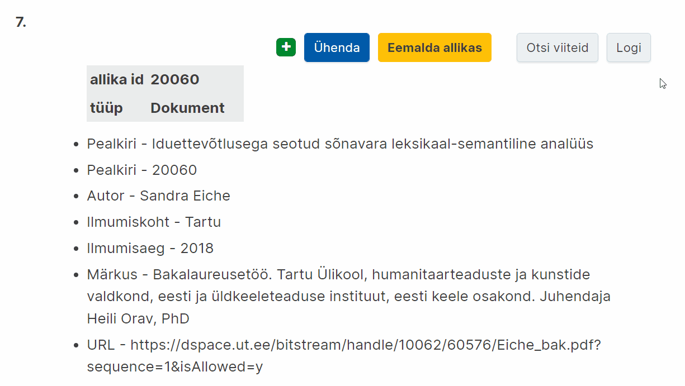
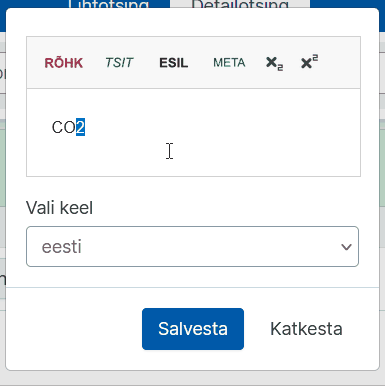

# Ekilexi kasutusjuhend

<button>[Avaleht](/index.md)</button>
<button>[Terminitöö sõnakoguga](/terminitoo.md)</button>
<button>[Allikad](/allikad.md)</button>

## Avaleht 

### Sisukord
- [Mis on Ekilex?](#mis-on-ekilex)
- [Kasutajaks registreerumine ja õiguste taotlemine](#kasutajaks-registreerumine-ja-õiguste-taotlemine)
  - [Terminibaasis muudatuste tegemine](#terminibaasis-muudatuste-tegemine)
- [Töölaud](#töölaud)
- [Katsetamine ja proovikirjete koostamine](#katsetamine-ja-proovikirjete-koostamine)
- [Kirjete muutmine pärast valmimist](#kirjete-muutmine-pärast-valmimist)
- [Terminite otsing](#terminite-otsing)
  - [Detailotsingu kriteeriumide peitmine](#detailotsingu-kriteeriumide-peitmine)
  - [Otsingutulemustes kindlale lehele minemine](#otsingutulemustes-kindlale-lehele-minemine)
- [Muutused kõigis vaadetes](#muutused-kõigis-vaadetes)
  - [Kirjesse märkuse lisamine](#kirjesse-märkuse-lisamine)
    - [Mõiste märkus](#mõiste-märkus)
    - [Definitsiooni märkus](#definitsiooni-märkus)
    - [Termini (ilmiku) märkus](#termini-ilmiku-märkus)
  - [Üla- või alaindeksi lisamine](#üla--või-alaindeksi-lisamine)
- [Uue sõnakogu loomine](#uue-sõnakogu-loomine)
  - [Sõnakogu muutmisõigused](#sõnakogu-muutmisõigused)
- [Mõistekirja, termini või muu kirje osise lisaja kuvamine](#mõistekirja-termini-või-muu-kirje-osise-lisaja-kuvamine)
    
---

### Mis on Ekilex?

Ekilex on Eesti Keele Instituudi sõnastiku- ja terminibaasisüsteem. Ekilex asub aadressil [https://ekilex.ee/](https://ekilex.ee/) ja on kõigile, kes soovivad oma terminibaasi koostada, tasuta kasutatav. <!--röhkem täpsustavat infot?-->

---

### Kasutajaks registreerumine ja õiguste taotlemine

- Ekilexi kasutamiseks tuleb luua endale kasutajakonto. Selleks mine Ekilexi avalehele ja vajuta nuppu „Loo kasutaja“.
- Avaneb kasutajaks registreerumise vorm. Pead sisestama oma ees- ja perekonnanime, e-posti aadressi ja valima parooli, mille sisestad kaks korda. 
<!-- - Pead ka läbi lugema kasutustingimused ja kinnitama nendega nõusoleku.-->
- Seejärel klõpsa nupul „Registreeru“. 
- Mõne sekundi jooksul saadetakse sinu e-postkasti kinnituskiri. Kui kirja pole tulnud, vaata ka rämpsposti kataloogi või trüki otsingureale „Ekilexi kasutaja registreerimine“. Oma konto aktiveerimiseks pead klõpsama kinnituskirjas saadetud aktiveerimislingil.
- Pärast lingil klõpsamist avaneb Ekilexi sisselogimisvorm koos teatega „Kasutaja on aktiveeritud, head kasutamist“.
- Sisselogimiseks sisesta oma e-posti aadress ja eelnevalt valitud parool ning klõpsa nupul „Sisene“.
<!--Õiguste taotlemise lehte ei kontrollinud veel, kuna peaks uue kasutaja tegema-->
- Kui oled sisse loginud, avaneb õiguste taotlemise leht, kus on teade: „See on EKI sõnastiku- ja terminibaasisüsteem Ekilex. Siin saad esitada taotluse Ekilexi kasutamiseks vaatamisõigusega. Kui vaja, vali sõnakogud, millele soovid muutmisõigust.“
  + Vaatamisõiguse saamiseks vajuta lihtsalt „Hakka Ekilexi kasutama“. Selle valikuga saad ka muutmisõiguse „Katsebaasile“, kus saab katsetada andmete sisestamist.
  + Muutmisõiguste taotlemiseks olemasolevale sõnakogule: 
    - Vajuta „Soovin sõnakogude muutmisõigust“ ja vali soovitud sõnakogu(d), mille autorite hulka sa kuulud. Pole mõtet valida sõnakogusid, millega sul puudub seos.
    - Muutmisõiguse taotlemise korral vajuta ka „Soovin põhjendada taotlust“ ja kirjuta lahtrisse lühidalt, kuidas oled sõnakoguga seotud. Põhjendus on kohustuslik.
    - Seejärel vajuta „Saada taotlus“.
    - Nüüd tuleb oodata, kuni Ekilexi administraator annab sulle küsitud õigused. Selle kohta saadetakse e-kiri. Pärast seda saad hakata Ekilexi kasutama. Kui oled õiguste saamise hetkel (e-kirja saabumise hetkel) Ekilexi sisse logitud, pead kõigepealt välja logima ja siis uuesti sisse logima, selleks, et õigused rakenduksid.

#### Terminibaasis muudatuste tegemine

Kui olete terminibaasi loonud, on teil õigused sinna mõistekirjeid lisada ja seal muid muudatusi teha. Kui näete, et ei saa oma terminibaasis muudatusi teha, võib probleem olla selles, et **valitud on vale sõnakogu muutja roll.**

Kõik Ekilexi kasutajad saavad liitudes katsebaasi muutmisõigused ehk katsebaasi muutja rolli. Kui luuakse uus terminibaas, on rolle, mille vahel valida, kaks. Kui te ei saa enda terminibaasis muutusi teha, on võimalik, et olete kogemata jäänud katsebaasi muutja rolli. **Enda rolli näeb ja saab muuta ülevalt sinise riba paremast nurgast oma nime alt. Peaksite sealt valima oma terminibaasi muutja rolli.**

1. Klõpsake üleval **sinise riba paremal pool** oma nimele
  
Pilt: Kasutajale klõpsamisel ilmuv rippmenüü

2. Kui soovite rolli vahetada, vajutage **“Vaheta”**. <!-- kas see on sama veel-->
  
Pilt: Klõpsake "Vaheta"

3. Klõpsake avanenud lehel kirja **“Vali roll”** järel olevale väljale ja **valige menüüst sobiv roll**.
  
Pilt: Rippmenüüst rolli valimine
<!-- pm sama protsess on ühe teise osa all... kas jätan alles või ühe kustutan?-->

Allikas: [link](https://terminoloogia.ee/ufaqs/miks-ma-ei-saa-enda-terminibaasis-muudatusi-teha/)

---

### Töölaud

Pärast sisselogimist satub kasutaja töölauale. Töölauaks nimetame Ekilexi avalehte sisselogitud olekus, millele pääseb igalt lehelt, klõpsates vasakult ülanurgast avanevat rakenduse menüüd ja valides „Ekilex“. Töölaual on järgmised valikud.

- **Leksikograafid:** sõnapõhine vaade sõnakogudele, mõeldud tööks leksikograafidele
- **Terminoloogid:** mõistepõhine vaade sõnakogudele, mõeldud tööks terminoloogidele
- **Sünonüümid:**
- **Tõlkevasted:**
- **Allikate otsing:** allikate otsing, lisamine, muutmine, kustutamine
- **Võrgustiku otsing:** ?
- **Kustutatud andmed:** ?
- **Sõnakogude haldus:** kõigi Ekilexis leiduvate sõnakogude loend ja lisamine, muutmine, kustutamine
- **Sõnaveebi tagasiside:** võimalus lugeda Sõnaveeb.ee saidile jäetud tagasisidet
- **Sõnaveebi statistika:** ?
- **Vali roll:** rippmenüü rolli valikuks. Siin tuleb valida selle sõnakogu muutja roll, milles olevaid andmeid soovid muuta. Kasutaja saab samaaegselt muuta ainult ühe sõnakogu andmeid. Muutja rolli olemasolu eelduseks on vastava sõnakogu muutmise õigus. Õiguseid saab juurde taotleda kasutaja profiilis. <!--lisada link osale kus õpetatakse õiguste taotlemist profiilis-->

Terminitööks soovitame kasutada terminoloogide otsingut ehk terminoloogi vaadet.

### Katsetamine ja proovikirjete koostamine

Ekilexis on üks terminibaas, mis ongi mõeldud katsetamiseks – **Katsebaas**. Katsebaasis võib mõistekirjeid luua igaüks olenemata sellest, mis valdkonna terminoloogiaga ta muidu töötab. Katsebaasi muutmisõigus on igal Ekilexi kasutajal ja seda ei pea eraldi taotlema. Katsebaasi kirjed ei muutu Sõnaveebis avalikuks ja jäävad alati vaid Ekilexi.

Selleks, et Katsebaasis kirjete koostamist katsetada, peaksite tegema läbi järgmised sammud:

<!-- kas siia peaks panema et 1. töölauale minemine? sest 2 step'i tegelt-->
1. Valima Ekilexis **Katsebaasi muutja rolli** (lugege rollidest ja nende vahetamisest lähemalt [siit](juhendi link)),
  
Pilt: Kasutaja alt "Vaheta" valimine
  
Pilt: Töölaual katsebaasi muutja rolli valimine

2. **Minema terminoloogide vaatesse** (töölaual “Terminoloogid”),
  
Pilt: Terminoloogide vaatesse minemine
<!-- selle jaoks uus gif?-->

3. Alustama mõistekirje loomist, vajutades nupule **“Uus mõiste”**. 

**NB!** On väga oluline, et pärast katsetamist, kui soovite hakata looma kirjeid enda terminibaasi, **vahetaksite Katsebaasi muutja rolli jälle enda terminibaasi muutja rolli vastu**. Muidu sisestate oma terminibaasi kirjed ekslikult Katsebaasi.

Rolli saab vahetada nii, nagu kirjeldatud 1. punktis, lihtsalt sel juhul peaks Katsebaasi muutja rolli asemel valima oma terminibaasi muutja/omaniku rolli.

---

### Kirjete muutmine pärast valmimist

**Ekilexis saab kõiki mõiste- ja allikakirje välju muuta ka pärast seda, kui olete kirjega enda hinnangul (selleks korraks) lõpetanud.**

Mõnikord võite soovida kirjet hiljem täiendada või avastate mõnel väljal näiteks trükivea. Isegi kui kirje on juba Sõnaveebis avalik, saate seda sellegipoolest Ekilexis parandada või täiendada. Järgmisel päeval on muudatus näha ka Sõnaveebis.

Ekilexis on iga välja **muutmisnupp sinine**. Muutmisnupp tekib, kui **lähete hiirekursoriga selle välja peale, mida soovite muuta**.

- Näide muutmisnupu klõpsamisest mõistekirjes:
  
Pilt: Hiirekursoriga väljadest üle liikumisel ilmuvad sinised muutmisnupud

- Näide muutmisnupu klõpsamisest allikakirjes:
  
Pilt: Hiirekursoriga väljadest üle liikumisel ilmuvad sinised muutmisnupud

Seejärel avaneb aken, kus saate soovitud muudatuse teha.

**NB! Muuta saab ainult neid kirjeid, mille olete kas ise loonud (allikakirjete puhul) või mis asuvad terminibaasis, mille muutmisõigus teil on (mõistekirjete puhul).** Enamasti on terminibaasi koostajatel õigus teha muudatusi vaid enda terminibaasi kirjetes.

---

### Terminite otsing

### Muutused kõigis vaadetes
<!-- kuidas ma seda sõnastan?-->

#### Kirjesse märkuse lisamine

Ekilexis saab mõistekirjesse lisada märkusi, millega saab mõiste, definitsiooni või termini kohta lisainfot anda. **Kuna mõiste definitsioon peaks olema ühelauseline, sobib märkuseväljale üldjuhul ka selline teave, mida tahaksite definitsiooni järele teiseks või kolmandaks lauseks lisada.**

Erinevalt definitsioonist võiksid märkused olla **vormistatud täislausetena, mis algavad suure tähega ja lõppevad punktiga**. Ühele märkuseväljale võib lisada mitu lauset. **Igal märkusel võiks olla ka allikaviide**: juhul kui tegu on allikast kopeeritud teabega, peaks viitama sellele allikale, kui aga märkuse on lisanud terminikomisjoni esindaja, peaks viitama komisjonile.

##### Mõiste märkus

Mõiste märkuse väljale sobib enamasti teave, mis ei kommenteeri konkreetset terminit või definitsiooni ega selle sõnastust. **Tegu on lisainfoga, mis annab teavet nähtuse (mõiste) kui sellise kohta.**  
(Kui mõiste ja termini erinevused on teile ebaselged, siis vaadake selle kohta lähemalt [siit](link sellele juhendis).)

1. Mõiste märkust saab lisada **plussmärgist**, mis asub **kirje kõige ülemises paremas nurgas**:
  
Pilt: Plussmärk kirje nurgas

2. Avanenud menüüst tuleks valida variant **“Märkus”**:
  
Pilt: Rippmenüüst variandi valimine

3. Seejärel avaneb tekstiväli, kuhu saate soovitud teksti sisestada.

##### Definitsiooni märkus

Definitsiooni märkuse väljale sobib enamasti teave, mis **kommenteerib definitsiooni või on sellega muul moel väga tihedalt seotud.**

1. Definitsiooni märkust saab lisada, kui **minna kursoriga definitsiooni teksti peale** ning **vajutada halli märkmepaberi nuppu**:
  
Pilt: Seletuse kõrval ilmuvad nupud, keskmine neist hall

2. Seejärel avaneb tekstiväli, kuhu saate soovitud teksti sisestada.

##### Termini (ilmiku) märkus

Termini märkuse väljale sobib teave, mis **kommenteerib terminit**. Sinna võib kanda näiteks lisainfot selle kohta, kes termini esimest korda kasutusele võttis. Kui sama mõiste kohta on aga näiteks kasutusel kaks paralleelterminit, võib termini märkuste abil täpsustada seda, mis ringkonnas emb-kumb termin kasutusel on (juhul kui selline erinevus on teada).

1. Termini märkust saab lisada **termini kõrval asuvast plussmärgist**:
  
Pilt: Termini paremal pool asub plussmärk
<!-- kui seda loeb screenreader siis ei anna see mingit lisa infot... peaks kuidagi ikka paremini kirjeldama??-->

2. Avanenud menüüst tuleks valida variant **“Ilmiku märkus”**:
  
Pilt: Rippmenüüst valida variant

3. Seejärel avaneb tekstiväli, kuhu saate soovitud teksti sisestada.

**Võimalik on lisada ka mitteavalikke märkusi**, mida väliskasutaja Sõnaveebis ei näe. Need tulevad kasuks siis, kui tegu on kommentaaridega, mis on mõeldud vaid terminibaasi koostajatele. Vaadake [siit](link juhendis), kuidas mõistekirje väljade avalikkust muuta.

#### Üla- või alaindeksi lisamine

Ekilexis saab ala- ja ülaindekseid lisada nupu **„Lisa märgendus“** alt. Üla- ja alaindekseid saab lisada kõigile tekstiväljadele, kuhu on võimalik ise infot kirjutada: termin, definitsioon, kasutusnäide, märkus.

1. Kõigepealt peaksite minema hiirega soovitud välja peale, millele indeksit lisada soovite (nt termin). Peaksite vajutama **tekkinud sinisele muutmisnupule.**
  
Pilt: Liikudes termini tekstile tekib muutmisnupp

2. Seejärel peaksite **valima (märgistama) selle osa, mida üla- või alakirja panna soovite**.
  
Pilt: Tekstikastis tulevase alaindeksi märgistamine sinisega

3. Pärast seda peaksite **vajutama rohelisele nupule kirjaga „Lisa märgendus“.**
  
Pilt: Nupp tekstivälja kohal, avaneb rippmenüü

4. Avanevast menüüst peaksite olenevalt soovist **valima kas üla- või alaindeksi.**
  
Pilt: Rippmenüüst valida sobiv

5. Seejärel peaksite vajutama **„Salvesta“.**
  
Pilt: Salvesta nupu vajutus
<!--no kas seda on ikka vaja...-->
Siis ilmub soovitud üla- või alaindeks kirjesse.
  
Pilt: Indeksiga termin

---

### Uue sõnakogu loomine

Klõpsa töölaual linki „Sõnakogude haldus“. Avaneb leht, millel on sõnakogude nimekiri. Vajuta üleval paremal nuppu „Lisa uus“. Avaneb uue sõnakogu loomise vorm.

- **Sõnakogu kood:** võimalikult lühike (3-10 märki) tähekombinatsioon, millest saab loodava sõnakogu identifikaator (lühitähis)
- **Nimi:** sõnakogu nimi
- **Tüüp:** kui lood terminibaasi, vali „terminibaas“, muul juhul „sõnakogu“
- **Kirjeldus ja kontaktid (Sõnaveebis nähtav):** sõnakogu lühikirjeldus, mida näidatakse Sõnaveebis
- **Lisainfo ja kontaktid (Sõnaveebis mitteavalik):** (kontakt)info, mis on nähtav teistele Ekilexi kasutajatele, kuid ei ole nähtav Sõnaveebis.
- **Sõnakogu pilt/logo:** 
- Juhul, kui soovid oma sõnakogu mõistetele lisada valdkonnamärgendeid:
  - **Valdkonna klassifikaatori päritolu:** vali valdkonna klassifikaatori kood. See võib olla mõne olemasoleva sõnakogu klassifikaator või iseseisev valdkonna klassifikaator (nt Lenoch, EKI üld). Oma klassifikaatori lisamiseks võta ühendust Ekilexi kasutajatoega.
  - **Valdkonnad:** Siin on loetelu eelnevalt valitud klassifikaatori kõikidest valdkondadest. Vali loetelust valdkonnamärgendid, mida soovid oma sõnakogus kasutada. Võib valida ükshaaval või vajutada „Vali kõik“.
- **Keeled:** vali keeled, mida soovid oma sõnakogus kasutada
- **Nähtav:** Ekilexis on sõnakogu info otsinguga leitav
- **Avalik:** sõnakogu on avalikustatud ja nähtav lõppkasutajale terminiveebis või sõnaveebis
- Kui vorm on täidetud, vajuta „Salvesta“

Sõnakogu on nüüd loodud ja ilmub sõnakogude nimistusse.

#### Sõnakogu muutmisõigused

Ekilexi kasutajal saab konkreetsele sõnakogule olla omaniku õigus, muutja õigus, vaataja õigus või mitte mingeid õigusi (viimasel juhul näeb kasutaja selles sõnakogus ainult avalikke termineid).
Kasutaja, kes lõi uue sõnakogu, saab selle omanikuõigused. Sõnakogu omanik saab lisaks sisu muumisele muuta ka sõnakogu seadeid ja metainfot, anda sõnakogu juurdepääsuõigusi teistele Ekilexi kasutajatele ja ka kustutada sõnakogu.

### Mõistekirja, termini või muu kirje osise lisaja kuvamine

Selles terminibaasis, mille olete loonud või mille muutmise õigus teil on, saate kirje koostajaid vaadata **logist**.  
Logi asub **mõistekirje üleval paremas nurgas**.
  
Pilt: Nupp asub mõistekirje üleval paremas nurgas, avaneb aken kust saab kuvada muutjaid ja muudetud andmeid

Logis on üsna palju tehnilist informatsiooni. Logisse süvenedes aga võib näha, et **seal kajastub info ka selle kohta, kes on kirje iga välja loonud**. Kõige alla kerides leiate selle inimese nime, kes lisas esimese termini ehk pani aluse kogu mõistekirjele (näites “keelend ükssarvik”).

Ka **allikakirjete** juures asub logi üleval paremas nurgas.

Kui teil **ei ole terminibaasi muutmisõigust**, siis te selle baasi kirjete logisid ei näe. Ekilexis on ligi 100 sõnakogu ning üldjuhul on tavakasutajal õigus muuta neist vaid ühte või paari: neid terminibaase, milles ta ise tegutseb.

Võib juhtuda, et teil tekib siiski küsimus mõne sellise mõistekirje kohta, mis asub baasis, mille logisid te ei näe. **Sel juhul võiksite võtta ühendust selle terminibaasi kontaktisikuga**.   
Eri terminibaaside kontaktisikud leiab kõige paremini üles Sõnaveebi **sõnakogude kirjeldustest**: https://sonaveeb.ee/collections. Esimene sõnakogu on EKI ühendsõnastik, ent allapoole kerides näete eri terminibaase, nende tutvustavat infot ja kontaktandmeid.

[Hakka pihta!](https://ekilex.eki.ee/)

Küsimuste korral kirjuta [kasutajatugi@ekilex.ee](mailto:kasutajatugi@ekilex.ee)!

Süsteemi alles arendatakse, mistõttu juhend täieneb.