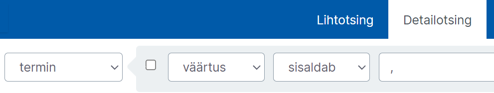

# Ekilexi kasutusjuhend

- [Mis on Ekilex?](#mis-on-ekilex)
- [Kasutajaks registreerumine ja õiguste taotlemine](#kasutajaks-registreerumine-ja-õiguste-taotlemine)
- [Töölaud](#töölaud)
- [Terminite otsing](#terminite-otsing)
- [Uue sõnakogu loomine](#uue-sõnakogu-loomine)
  - [Sõnakogu muutmisõigused](#sõnakogu-muutmisõigused)
- [Terminitöö sõnakoguga](#terminitöö-sõnakoguga)
  - [Terminite otsing](#terminite-otsing-1)
  - [Otsingutulemused tabelina](#otsingutulemused-tabelina)
  - [Uue mõistekirje loomine](#uue-mõistekirje-loomine)
  - [Allikaviite lisamine mõistekirjes](#allikaviite-lisamine-mõistekirjes)
  - [Olemasolevasse mõistekirjesse lisamine](#olemasolevasse-mõistekirjesse-lisamine)
- [Allikad](#allikad)
  - [Allikate otsing](#allikate-otsing)
  - [Allika loomine](#allika-loomine)
  - [Allika muutmine](#allika-muutmine)
  - [Allika kustutamine](#allika-kustutamine)
    

### Mis on Ekilex?

Ekilex on Eesti Keele Instituudi sõnastiku- ja terminibaasisüsteem. Ekilex asub aadressil [https://ekilex.ee/](https://ekilex.ee/) ja on kõigile, kes soovivad oma terminibaasi koostada, tasuta kasutatav. <!--röhkem täpsustavat infot?-->

### Kasutajaks registreerumine ja õiguste taotlemine

- Ekilexi kasutamiseks tuleb luua endale kasutajakonto. Selleks mine Ekilexi avalehele ja vajuta nuppu „Loo kasutaja“.
- Avaneb kasutajaks registreerumise vorm. Pead sisestama oma ees- ja perekonnanime, e-posti aadressi ja valima parooli, mille sisestad kaks korda. 
<!-- - Pead ka läbi lugema kasutustingimused ja kinnitama nendega nõusoleku.-->
- Seejärel klõpsa nupul „Registreeru“. 
- Mõne sekundi jooksul saadetakse sinu e-postkasti kinnituskiri. Kui kirja pole tulnud, vaata ka rämpsposti kataloogi või trüki otsingureale „Ekilexi kasutaja registreerimine“. Oma konto aktiveerimiseks pead klõpsama kinnituskirjas saadetud aktiveerimislingil.
- Pärast lingil klõpsamist avaneb Ekilexi sisselogimisvorm koos teatega „Kasutaja on aktiveeritud, head kasutamist“.
- Sisselogimiseks sisesta oma e-posti aadress ja eelnevalt valitud parool ning klõpsa nupul „Sisene“.
<!--Õiguste taotlemise lehte ei kontrollinud veel, kuna peaks uue kasutaja tegema-->
- Kui oled sisse loginud, avaneb õiguste taotlemise leht, kus on teade: „See on EKI sõnastiku- ja terminibaasisüsteem Ekilex. Siin saad esitada taotluse Ekilexi kasutamiseks vaatamisõigusega. Kui vaja, vali sõnakogud, millele soovid muutmisõigust.“
  + Vaatamisõiguse saamiseks vajuta lihtsalt „Hakka Ekilexi kasutama“. Selle valikuga saad ka muutmisõiguse „Katsebaasile“, kus saab katsetada andmete sisestamist.
  + Muutmisõiguste taotlemiseks olemasolevale sõnakogule: 
    - Vajuta „Soovin sõnakogude muutmisõigust“ ja vali soovitud sõnakogu(d), mille autorite hulka sa kuulud. Pole mõtet valida sõnakogusid, millega sul puudub seos.
    - Muutmisõiguse taotlemise korral vajuta ka „Soovin põhjendada taotlust“ ja kirjuta lahtrisse lühidalt, kuidas oled sõnakoguga seotud.
    - Seejärel vajuta „Saada taotlus“.
    - Nüüd tuleb oodata, kuni Ekilexi administraator annab sulle küsitud õigused. Selle kohta saadetakse e-kiri. Pärast seda saad hakata Ekilexi kasutama. Kui oled õiguste saamise hetkel (e-kirja saabumise hetkel) Ekilexi sisse logitud, pead kõigepealt välja logima ja siis uuesti sisse logima, selleks, et õigused rakenduksid.

### Töölaud

Pärast sisselogimist satub kasutaja töölauale. Töölauaks nimetame Ekilexi avalehte sisselogitud olekus, millele pääseb igalt lehelt, klõpsates vasakult ülanurgast avanevat rakenduse menüüd ja valides „Ekilex“. Töölaual on järgmised valikud.

- **Leksikograafid:** sõnapõhine vaade sõnakogudele, mõeldud tööks leksikograafidele
- **Terminoloogid:** mõistepõhine vaade sõnakogudele, mõeldud tööks terminoloogidele
- **Sünonüümid:**
- **Tõlkevasted:**
- **Allikate otsing:** allikate otsing, lisamine, muutmine, kustutamine
- **Võrgustiku otsing:** ?
- **Kustutatud andmed:** ?
- **Sõnakogude haldus:** kõigi Ekilexis leiduvate sõnakogude loend ja lisamine, muutmine, kustutamine
- **Sõnaveebi tagasiside:** võimalus lugeda Sõnaveeb.ee saidile jäetud tagasisidet
- **Sõnaveebi statistika:** ?
- **Vali roll:** rippmenüü rolli valikuks. Siin tuleb valida selle sõnakogu muutja roll, milles olevaid andmeid soovid muuta. Kasutaja saab samaaegselt muuta ainult ühe sõnakogu andmeid. Muutja rolli olemasolu eelduseks on vastava sõnakogu muutmise õigus. Õiguseid saab juurde taotleda kasutaja profiilis. <!--lisada link osale kus õpetatakse õiguste taotlemist profiilis-->

Terminitööks soovitame kasutada terminoloogide otsingut ehk terminoloogi vaadet.

### Terminite otsing

- Vajuta töölaual „Terminoloogid“.
- Avaneb terminoloogi vaade. Vajuta nuppu „Valitud sõnakogusid: 0“. Vali linnukestega sõnakogud, millest soovid otsida, ja vajuta „Vali“.
- Sisesta otsisõna. Kasutada võib metamärke: 
  - **?** = 1 suvaline tähemärk (nt kui otsid „m?iste“ siis leiad nt „mõiste“, „muiste“);
  - **\*** = 0 või rohkem suvalisi tähemärke. (nt kui otsid „\*hiir\*“, siis leiad nii „hiir“, „arvutihiir“, „hiirehernes“ kui „aedhiirehernes“.)
- Vajuta „Otsi“.
Täpsem Terminoloogide töökäigu juhend on [siin](#terminitöö-sõnakoguga).

### Uue sõnakogu loomine

Klõpsa töölaual linki „Sõnakogude haldus“. Avaneb leht, millel on sõnakogude nimekiri. Vajuta üleval paremal nuppu „Lisa uus“. Avaneb uue sõnakogu loomise vorm.

- **Sõnakogu kood:** võimalikult lühike (3-10 märki) tähekombinatsioon, millest saab loodava sõnakogu identifikaator (lühitähis)
- **Nimi:** sõnakogu nimi
- **Tüüp:** kui lood terminibaasi, vali „terminibaas“, muul juhul „sõnakogu“
- **Kirjeldus ja kontaktid (Sõnaveebis nähtav):** sõnakogu lühikirjeldus, mida näidatakse Sõnaveebis
- **Lisainfo ja kontaktid (Sõnaveebis mitteavalik):** (kontakt)info, mis on nähtav teistele Ekilexi kasutajatele, kuid ei ole nähtav Sõnaveebis.
- **Sõnakogu pilt/logo:** 
- Juhul, kui soovid oma sõnakogu mõistetele lisada valdkonnamärgendeid:
  - **Valdkonna klassifikaatori päritolu:** vali valdkonna klassifikaatori kood. See võib olla mõne olemasoleva sõnakogu klassifikaator või iseseisev valdkonna klassifikaator (nt Lenoch, EKI üld). Oma klassifikaatori lisamiseks võta ühendust Ekilexi kasutajatoega.
  - **Valdkonnad:** Siin on loetelu eelnevalt valitud klassifikaatori kõikidest valdkondadest. Vali loetelust valdkonnamärgendid, mida soovid oma sõnakogus kasutada. Võib valida ükshaaval või vajutada „Vali kõik“.
- **Keeled:** vali keeled, mida soovid oma sõnakogus kasutada
- **Nähtav:** Ekilexis on sõnakogu info otsinguga leitav
- **Avalik:** sõnakogu on avalikustatud ja nähtav lõppkasutajale terminiveebis või sõnaveebis
- Kui vorm on täidetud, vajuta „Salvesta“

Sõnakogu on nüüd loodud ja ilmub sõnakogude nimistusse.

#### Sõnakogu muutmisõigused

Ekilexi kasutajal saab konkreetsele sõnakogule olla omaniku õigus, muutja õigus, vaataja õigus või mitte mingeid õigusi (viimasel juhul näeb kasutaja selles sõnakogus ainult avalikke termineid).
Kasutaja, kes lõi uue sõnakogu, saab selle omanikuõigused. Sõnakogu omanik saab lisaks sisu muumisele muuta ka sõnakogu seadeid ja metainfot, anda sõnakogu juurdepääsuõigusi teistele Ekilexi kasutajatele ja ka kustutada sõnakogu.

### Terminitöö sõnakoguga

#### Terminite otsing

<!--kirjelda täpsemalt mida detailotsing endast kujutab-->

##### Otsingutulemused tabelina
Ekilexis saab mõistekirjete otsingutulemusi kuvada tabelina. See toimib **kuni 50 kirje puhul**. 
Et tabelivaadet näha, käituge järgmiselt.
- Tehke soovitud otsing.
- Vajutage otsingutulemuste ülaosas **nupule "Tabelivaade"**:

Pilt: Terminoloogide otsingus Tabelivaate avamine
<!--kas ma peaks pildikirjeldused ka tegema? ma eriti ei oska...also figcaption ei tööta väga??-->

- Kui otsingutulemustes on kuni 50 kirjet, avaneb tabel eraldi vahelehel:

Pilt: Otsingu tulemused tabelivormis
- Tabelivaates on näha seletused, kirjes olevad terminid ja kasutusnäited. Samuti kuvatakse iga osise avalikkus(tabaluku ikoon).

#### Uue mõistekirje loomine

###### Enne uue mõistekirje lisamist veenduge, et **Tegutsete Ekilexis õiges rollis** (enda terminibaasi muutja või omaniku rollis). Rollide ja nende vahetamise kohta lugege lähemalt [Rollid](#rollid)

<!-- video on päris aegunud, teistsugune interface ja protsess... kas eemaldada ja teha uus?-->

Video: Mõistekirje loomine Ekilexis

- Mine töölauale, avades vasakul ülanurgas rakenduse menüü ja valides sealt „Ekilex“.
- Veendu, et valitud on soovitud sõnakogu muutja roll. Vastasel juhul vali see rippmenüüst „Vali roll“.
- Ava töölaual link „Terminoloogid“
- Valige Terminoloogide vaates loetelust "Valitud sõnakogud" **kõik sõnakogud.** See on oluline, et süsteem oskaks lisatavat terminit teiste terminibaaside infoga võrrelda.

Pilt: Terminoloogide vaates sõnakogude valimine

  - Kõiki sõnakogusid aitab valida nupp **"Vali kõik"**.

Pilt: Sõnakogude valimisel saab vajutada nuppu "Vali kõik"

- Vajuta sinisel navigeerimisribal „Uus mõiste“. Avaneb uue termini sisestusvorm. Seejärel
  - sisesta termin (ehk keelend),
  - selle all on kuvatud sõnakogu nimi, kuhu termin lisatakse,
  - vali rippmenüüst keel,
  - vajuta „Lisa termin“.
  
  Pilt: Termini lisamine

- Kui sisestatud termin ei esine üheski olemasolevas sõnakogus, siis luuakse uus termin ja mõiste ning kuvatakse kogu info selle mõiste kohta terminoloogi otsingu vaates.

- Kui sisestatud termin juba esineb Ekilexis, kuvab süsteem teile sama kujuga terminid ja nende kirjed, mis on teistesse sõnastikesse ja terminibaasidesse lisatud. Tehke linnuke selle tähendusega termini ette, mis sarnaneb teie omaga enim.

Pilt: Terminite valikust sobivaima valimine
  - Mõnikord võib juhtuda, et lehel toodud kirjetel puuduvad definitsioonid. Sel juhul näete kogu kirjet, kui klõpsate nupule **“Vaata tervet kirjet”**, et avada see uuel vahelehel.  
  Kui te ei leia sellelt lehelt ka pärast “Vaata tervet kirjet” nuppudel klõpsamist ühtegi sobivat tähendust, siis kirjutage aadressile kairi.janson@eki.ee.

- Klõpsake sinisel nupul kirjaga **"Loo uus mõiste"**.  
Misjärel luuakse uus termin ja mõiste ning kuvatakse need. <!--tee kindlaks kas kuvatakse-->

<!--no siin saab ikka kenasti  juurde kirjutada.-->

#### Allikaviite lisamine mõistekirjes

Terminitöös on oluline viidata termini allikatele. Ekilexi saab salvestada allikakirjeid ja terminite juurest neile viidata. Ühe allika jaoks piisab Ekilexis ühest allikakirjest, millele saab viidata erinevatest sõnakogudest. Kui juhtumisi on loodud mitu allikakirjet samale allikale, saab neid ühendada kokku üheks allikakirjeks.

Ekilexi kontekstis nimetatakse allikakirjeid ka lühemalt lihtsalt allikateks. 

<!--Allikate otsimine, lisamine ja muutmine on [siin]()-->
<!--allikat saab lisada ka term vaates. kas kopeerin siia selle juhendi ilma "mine Allikate Otsing vaatesse" reata, või suunan siit sinna sektsiooni lingiga?-->

Kui allikas on loodud, siis saab mõistekirjes tekitada sellele erinevate väljade juures (nagu termin, märkus, definitsioon) viiteid. Terminile saab allikaviite lisada rohelise „+“ nupuga, valides „Allikaviide“. Definitsioonile saab allika lisada, liikudes hiirega selle kohale. Tekib roheline allikaviite lisamise nupuke.
Vajutades allikaviite lisamise nupule, avaneb allika otsing. Seal saab otsida kõikide allika atribuutide järgi, kaasa arvatud tema nime (SOURCE_NAME) järgi.

Allika otsimisel on kindlasti abiks tärn „\*“, sest selle abil saab leida osalisi vasteid. Nt otsides "int\*meteo\*" leitakse "INTERNATIONAL METEOROLOGICAL VOCABULARY", sest * asendab suvalist arvu märke. Kui nimesid on mitu, nagu selles näites, saab raadionupuga valida selle nime, mida hakatakse kuvama allikaviitena.

Lahter „Siseviide“ on selle jaoks, kui peaks olema soov täpsustada asukohta selles allikas, nt „lk 69“ ja see kuvatakse allikaviite järel.

#### Olemasolevasse mõistekirjesse lisamine

Terminibaasid on mõistepõhised, mis tähendab, et **ühes mõistekirjes on koos kõik sama mõiste kohta käivad terminid (sünonüümid), sh paralleelvariandid ning terminid teistes keeltes.**

Kui soovite juba **olemasolevasse kirjesse uut terminit lisada** (ükskõik, mis keeles), peaksite vajutama mõistekirje ülaosas nupule **“Lisa termin”**.  
Lisatav termin võib olla nii muukeelne vaste kui ka eesti- või muukeelne sünonüüm.

Pilt: Uue termini lisamine

**Kindlasti ei tohiks sünonüüme või muid terminivariante kirjutada koos ühele ja samale terminiväljale.  
Terminiväljal ei tohiks olla komasid, semikooloneid, kaldkriipse või muid sümboleid, välja arvatud siis, kui need on termini enda osa.**

##### Näide

Oletame, et tahan sünonüümidena terminibaasi kanda terminid **hõberemmelgas** ja **hõbepaju.**

- Kui hakkan mõistekirjet alles looma, vajutan Ekilexis ülevalt siniselt ribalt nuppu “Uus mõiste”. Lisan termini *hõberemmelgas*. 
- Kui mõistekirje on juba loodud ja soovin kirjesse lisada ka teise termini (sünonüümi), pean selle lisama uuele terminiväljale. **Selleks vajutan loodud kirjes nuppu “Lisa termin”**. Trükin avanenud väljale termini *hõbepaju* ja valin keeleks eesti.
  - Muukeelse termini (vaste) lisamine käib samamoodi, ainult et eesti keele asemel tuleb avanenud aknas valida termini õige keel.
- Lisatud terminid on nüüd esitatud eri terminiväljadel ja vaade on järgmine. Mõlemad terminid tulevad välja, kui neid Ekilexis või Sõnaveebis otsida.

Pilt: näidatud *hõberemmelgas* ja *hõbepaju* sünonüümidena

Et leida oma terminibaasist termineid, mis võivad olla ühel väljal koma, semikooloni või mõne muu märgiga eraldatud, võiksite kasutada järgmist otsingut:

Pilt: Terminoloogide vaate detailotsing: termin; väärtus; sisaldab; soovitud märk

### Allikad

#### Allikate otsing

Juba sisestatud allikate nägemiseks vali rakenduse menüüst „Allikate otsing“. 
Allikaid saab otsida ükskõik missuguse andmekategooria järgi, nt pealkiri, autor, ISBN, ISSN, väljaandja vm.

Vaikimisi avaneb lihtotsing, kus otsikasti võib sisestada ükskõik missuguse andmekategooria.
Siin on väga soovitav kasutada metamärke, nt lisades otsisõna ette ja taha „\*“. 

#### Allika loomine


Video: Allikakirje loomine Ekilexis

###### NB! Enne uue allika lisamist võiksite teha allika nimega otsingu, et veenduda, ega sama allikakirjet pole juba lisatud.

- Allikakirjeid saab lisada valides rakenduse menüüst „Allikate otsing“ ja avanenud lehel vajutades **„Lisa uus allikas“**.

Pilt: Nupp "Lisa uus allikas"

- **Pealkiri** (allika nimi, SOURCE_NAME) on kirjaliku allika (näiteks raamatu) puhul harilikult selle pealkiri, aga selle võib vajadusel ka ise vabalt valida. Allika nimi kuvatakse ka allikaviitena mõiste kirjes.

- Kui allikal on väga pikk nimi ja seda on samas mõistekirjes vaja kasutada mitmes kohas, võib allikale leiutada mingi lühendi (**Lühinimi**) ja lisada see lühend ühe nimetusena (nt „WMO“), siis saab mõistekirjes kasutada lühendit ja see ei võta nii palju ruumi ekraanil.

Pilt: Lühinime väli on pildil näidatud punase kastiga

- Allika **tüübiks** tuleks kirjaliku allika puhul valida Dokument.

- Alumises kastis saab allikale lisada muid informatiivseid välju (atribuute), näiteks vaikimisi on seal valitud autor. Kui raamatul on mitu autorit, võib iga ühe jaoks luua eraldi välja, aga pole ka probleemi, kui nad pannakse komadega eraldatult samale väljale. Samale väljale pannakse vajadusel ka autori tüüp, nt „koostanud Juhan Juurikas“ või „toimetanud J. Tatikas“.

- Vajutades rohelisele „+“ nupule saab allikale lisada veel uusi välju. Samuti saab allikale välju lisada hiljem, kui allikas on juba loodud. Saab ka eemaldada välju punase „-“ nupuga.
<!--siia võiks äkki väikese png-ga lisada nupu pildid?-->

- Ühel allikal võib olla ka mitu nime, näiteks pealkiri erinevates keeltes. Nimesid saab juurde lisada nii, nagu ka muid allika välju (valides välja tüübiks Lühinimi/pealkiri). 

- Vajutage nuppu **“Lisa”**.

#### Allika muutmine

Allika muutmine tähendab siis sisuliselt allikakirje mõne välja ehk allika atribuudi lisamist/muutmist/kustutamist.

- Vali rakenduse menüüst „Allikate otsing“.
- Atribuudi lisamiseks:
  - Otsi allikas, mida tahad muuta.
  - Vajuta rohelisele „+“ nupule. Avaneb atribuudi lisamise vorm.
  - Vali rippmenüüst atribuudi tüüp.
  - Sisesta all olevale väljale atribuudi väärtus.
  - Vajuta „Lisa“.
- Atribuudi muutmiseks:
  - Otsi allikas, mida tahad muuta.
  - Liigu hiire kursoriga välja peale, mida tahad muuta. Välja lõppu tekivad nupukesed.
  
  Pilt: Välja lõppu tekivad muutmis- ja kustutamisnupp
  - Vajuta sinisele nupukesele „Muuda“.
  - Avaneb välja muutmisvorm.
  - Muuda välja sisu, salvestamiseks vajuta „Muuda“.
  
  Pilt: Sisu lisamine ja salvestamine
- Atribuudi kustutamiseks:
  - Otsi allikas, mida tahad muuta.
  - Liigu hiire kursoriga välja peale, mida tahad muuta. Välja lõppu tekivad nupukesed.
  - Vajuta kollasele nupukesele „x“ („Kustuta“).
  - Küsitakse kustutamise kinnitust. Vajuta „Jah“.

#### Allika kustutamine

Allikakirje kustutamiseks:
- Vali rakenduse menüüst „Allikate otsing“.
- Otsi allikas, mida tahad kustutada
- Vajuta kollasele nupule „Eemalda allikas“.

#### Allika ühendamine ?

[Hakka pihta!](https://ekilex.eki.ee/)

Küsimuste korral kirjuta [kasutajatugi@ekilex.ee](mailto:kasutajatugi@ekilex.ee)!

Süsteemi alles arendatakse, mistõttu juhend täieneb.

