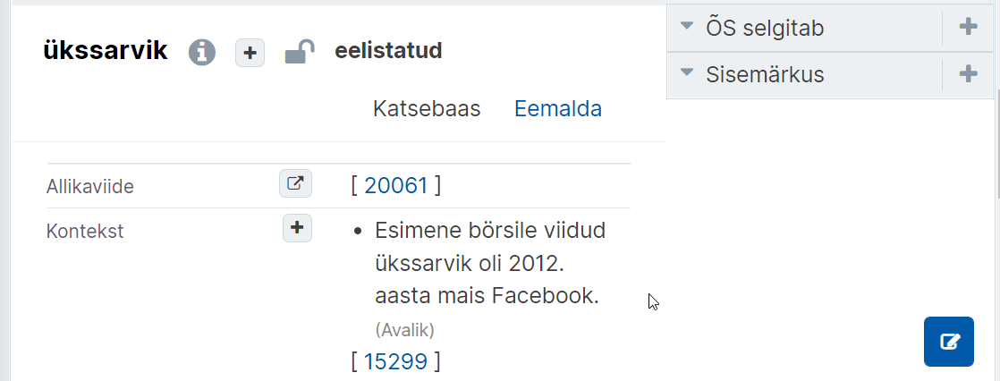
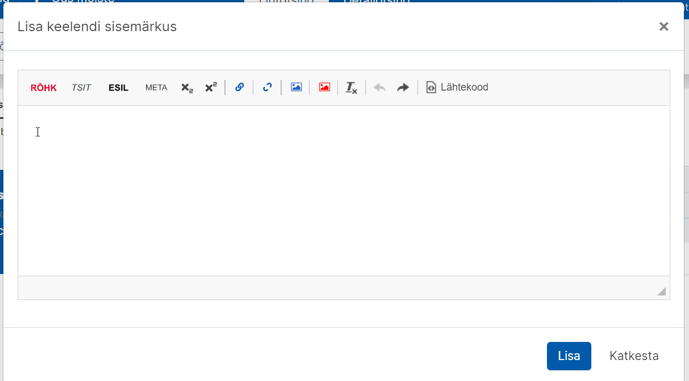
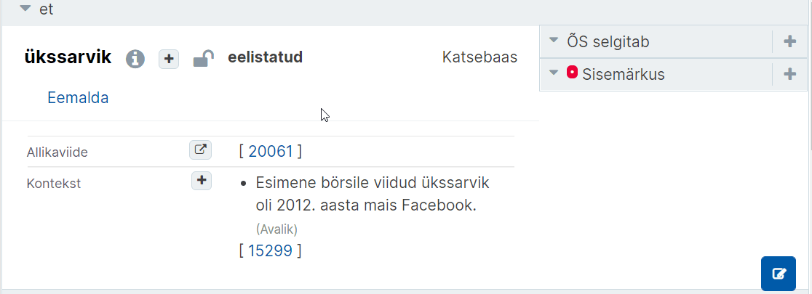
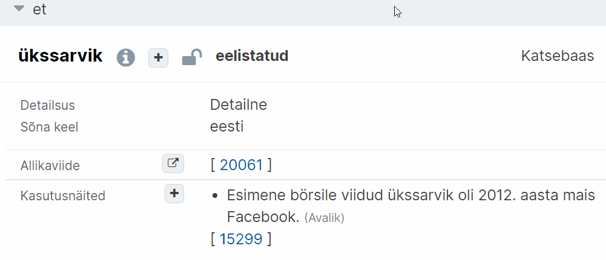
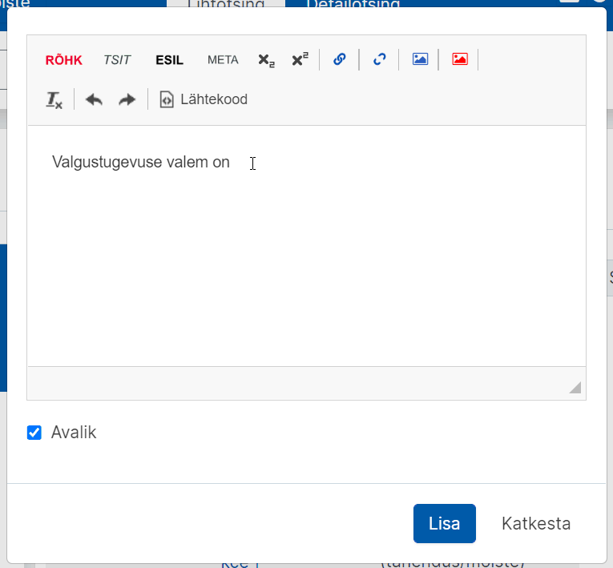

# Ekilexi kasutusjuhend

<button>[Avaleht](/index.md)</button>
<button>[Terminitöö sõnakoguga](/terminitoo.md)</button>
<button>[Allikad](/allikad.md)</button>

## Terminitöö sõnakoguga

### Sisukord
  - [Terminite otsing](#terminite-otsing-1)
  - [Otsingutulemused tabelina](#otsingutulemused-tabelina)
  - [Uue mõistekirje loomine](#uue-mõistekirje-loomine)
  - [Allikaviite lisamine mõistekirjes](#allikaviite-lisamine-mõistekirjes)
  - [Olemasolevasse mõistekirjesse lisamine](#olemasolevasse-mõistekirjesse-lisamine)
  - [Mitteavaliku sisemärkuse lisamine](#mitteavaliku-sisemärkuse-lisamine)

---

### Terminite otsing

<!--kirjelda täpsemalt mida detailotsing endast kujutab-->

#### Otsingutulemused tabelina
Ekilexis saab mõistekirjete otsingutulemusi kuvada tabelina. See toimib **kuni 50 kirje puhul**. 
Et tabelivaadet näha, käituge järgmiselt.
- Tehke soovitud otsing.
- Vajutage otsingutulemuste ülaosas **nupule "Tabelivaade"**:

Pilt: Terminoloogide otsingus Tabelivaate avamine
<!--kas ma peaks pildikirjeldused ka tegema? ma eriti ei oska...also figcaption ei tööta väga??-->

- Kui otsingutulemustes on kuni 50 kirjet, avaneb tabel eraldi vahelehel:

Pilt: Otsingu tulemused tabelivormis
- Tabelivaates on näha seletused, kirjes olevad terminid ja kasutusnäited. Samuti kuvatakse iga osise avalikkus(tabaluku ikoon).

---

### Uue mõistekirje loomine

Enne uue mõistekirje lisamist veenduge, et **Tegutsete Ekilexis õiges rollis** (enda terminibaasi muutja või omaniku rollis). Rollide ja nende vahetamise kohta lugege lähemalt [Rollid](#rollid)

<!-- video on päris aegunud, teistsugune interface ja protsess... kas eemaldada ja teha uus?-->

Video: Mõistekirje loomine Ekilexis

- Mine töölauale, avades vasakul ülanurgas rakenduse menüü ja valides sealt „Ekilex“.
- Veendu, et valitud on soovitud sõnakogu muutja roll. Vastasel juhul vali see rippmenüüst „Vali roll“.
- Ava töölaual link „Terminoloogid“
- Valige Terminoloogide vaates loetelust "Valitud sõnakogud" **kõik sõnakogud.** See on oluline, et süsteem oskaks lisatavat terminit teiste terminibaaside infoga võrrelda.

Pilt: Terminoloogide vaates sõnakogude valimine

  - Kõiki sõnakogusid aitab valida nupp **"Vali kõik"**.

Pilt: Sõnakogude valimisel saab vajutada nuppu "Vali kõik"

- Vajuta sinisel navigeerimisribal „Uus mõiste“. Avaneb uue termini sisestusvorm. Seejärel
  - sisesta termin (ehk keelend),
  - selle all on kuvatud sõnakogu nimi, kuhu termin lisatakse,
  - vali rippmenüüst keel,
  - vajuta „Lisa termin“.
  
  Pilt: Termini lisamine

- Kui sisestatud termin ei esine üheski olemasolevas sõnakogus, siis luuakse uus termin ja mõiste ning kuvatakse kogu info selle mõiste kohta terminoloogi otsingu vaates.

- Kui sisestatud termin juba esineb Ekilexis, kuvab süsteem teile sama kujuga terminid ja nende kirjed, mis on teistesse sõnastikesse ja terminibaasidesse lisatud. Tehke linnuke selle tähendusega termini ette, mis sarnaneb teie omaga enim.

Pilt: Terminite valikust sobivaima valimine
  - Mõnikord võib juhtuda, et lehel toodud kirjetel puuduvad definitsioonid. Sel juhul näete kogu kirjet, kui klõpsate nupule **“Vaata tervet kirjet”**, et avada see uuel vahelehel.  
  Kui te ei leia sellelt lehelt ka pärast “Vaata tervet kirjet” nuppudel klõpsamist ühtegi sobivat tähendust, siis kirjutage aadressile kairi.janson@eki.ee.

- Klõpsake sinisel nupul kirjaga **"Loo uus mõiste"**.  
Misjärel luuakse uus termin ja mõiste ning kuvatakse need. <!--tee kindlaks kas kuvatakse-->

#### Allikaviite lisamine mõistekirjes

Terminitöös on oluline viidata termini allikatele. Ekilexi saab salvestada allikakirjeid ja terminite juurest neile viidata. Ühe allika jaoks piisab Ekilexis ühest allikakirjest, millele saab viidata erinevatest sõnakogudest. Kui juhtumisi on loodud mitu allikakirjet samale allikale, saab neid ühendada kokku üheks allikakirjeks.

Ekilexi kontekstis nimetatakse allikakirjeid ka lühemalt lihtsalt allikateks. 

<!--Allikate otsimine, lisamine ja muutmine on [siin]()-->
<!--allikat saab lisada ka term vaates. kas kopeerin siia selle juhendi ilma "mine Allikate Otsing vaatesse" reata, või suunan siit sinna sektsiooni lingiga?-->

Kui allikas on loodud, siis saab mõistekirjes tekitada sellele erinevate väljade juures (nagu termin, märkus, definitsioon) viiteid. Terminile saab allikaviite lisada rohelise „+“ nupuga, valides „Allikaviide“. Definitsioonile saab allika lisada, liikudes hiirega selle kohale. Tekib roheline allikaviite lisamise nupuke.
Vajutades allikaviite lisamise nupule, avaneb allika otsing. Seal saab otsida kõikide allika atribuutide järgi, kaasa arvatud tema nime (SOURCE_NAME) järgi.

Allika otsimisel on kindlasti abiks tärn „\*“, sest selle abil saab leida osalisi vasteid. Nt otsides "int\*meteo\*" leitakse "INTERNATIONAL METEOROLOGICAL VOCABULARY", sest * asendab suvalist arvu märke. Kui nimesid on mitu, nagu selles näites, saab raadionupuga valida selle nime, mida hakatakse kuvama allikaviitena.

Lahter „Siseviide“ on selle jaoks, kui peaks olema soov täpsustada asukohta selles allikas, nt „lk 69“ ja see kuvatakse allikaviite järel.

---

### Olemasolevasse mõistekirjesse lisamine

Terminibaasid on mõistepõhised, mis tähendab, et **ühes mõistekirjes on koos kõik sama mõiste kohta käivad terminid (sünonüümid), sh paralleelvariandid ning terminid teistes keeltes.**

Kui soovite juba **olemasolevasse kirjesse uut terminit lisada** (ükskõik, mis keeles), peaksite vajutama mõistekirje ülaosas nupule **“Lisa termin”**.  
Lisatav termin võib olla nii muukeelne vaste kui ka eesti- või muukeelne sünonüüm.

Pilt: Uue termini lisamine

**Kindlasti ei tohiks sünonüüme või muid terminivariante kirjutada koos ühele ja samale terminiväljale.  
Terminiväljal ei tohiks olla komasid, semikooloneid, kaldkriipse või muid sümboleid, välja arvatud siis, kui need on termini enda osa.**

##### Näide

Oletame, et tahan sünonüümidena terminibaasi kanda terminid **hõberemmelgas** ja **hõbepaju.**

- Kui hakkan mõistekirjet alles looma, vajutan Ekilexis ülevalt siniselt ribalt nuppu “Uus mõiste”. Lisan termini *hõberemmelgas*. 
- Kui mõistekirje on juba loodud ja soovin kirjesse lisada ka teise termini (sünonüümi), pean selle lisama uuele terminiväljale. **Selleks vajutan loodud kirjes nuppu “Lisa termin”**. Trükin avanenud väljale termini *hõbepaju* ja valin keeleks eesti.
  - Muukeelse termini (vaste) lisamine käib samamoodi, ainult et eesti keele asemel tuleb avanenud aknas valida termini õige keel.
- Lisatud terminid on nüüd esitatud eri terminiväljadel ja vaade on järgmine. Mõlemad terminid tulevad välja, kui neid Ekilexis või Sõnaveebis otsida.

Pilt: näidatud *hõberemmelgas* ja *hõbepaju* sünonüümidena

Et leida oma terminibaasist termineid, mis võivad olla ühel väljal koma, semikooloni või mõne muu märgiga eraldatud, võiksite kasutada järgmist otsingut:

Pilt: Terminoloogide vaate detailotsing: termin; väärtus; sisaldab; soovitud märk

#### Mitteavaliku sisemärkuse lisamine
Nii terminite kui ka mõisteploki (kirje ülemine osa, mis sisaldab definitsioone, seotud termineid ja valdkondi) juurde saab lisada sisemärkusi, mis ei muutu Sõnaveebis avalikuks. Sisemärkustesse saab kirjutada teavet, mis on oluline vaid komisjonile endale.

- **Sisemärkuse nupp** asub terminite või mõisteploki juures paremal pool (kirja “ÕS selgitab” juures).

Pilt: Sisemärkuse "+" nupu asukoht
- Avanevasse tekstiaknasse saab trükkida sisemärkuse. Sisemärkuse lisamiseks tuleb vajutada nuppu **“Lisa”**.

Pilt: Sisemärkuse lisamine
- Sisemärkuse olemasolu kirjes näitab selle nupu juures olev **punane täpike**. Kui täpikese kõrval olevale **noolele klõpsata**, saab sisemärkust näha. Uuesti klõpsates saab sisemärkuse sulgeda.

Pilt: Sisemärkuse olemasolu ja selle avamine
- **Terminoloogide vaate detailotsingust on võimalik üles leida kirjed, kuhu olete sisemärkuse lisanud**. Selleks tuleb minna detailotsingusse ja teha järgmised valikud.  
**NB!** Esimesest tulbast peab olema valitud “termin” juhul, kui tahate leida termini juurde lisatud sisemärkusi. Kui lisasite sisemärkuse kõige üles, st mõisteplokki (definitsioonide juurde), leiate sellised kirjed üles, kui valite otsingus esimesest rippmenüüst “Mõiste”.

Pilt: Detailotsingu kasutamine sisemärkusega terminite otsimiseks

Ekilexis saab mitteavalikuks muuta ka neid välju, mis on muidu avalikud (termin koos selle juures oleva teabega, definitsioon, kasutusnäide jm).

---

### Kirjete osiste mitteavalikuks muutmine

Ekilexis on mõistekirje iga tekstivälja juures võimalik valida selle avalikkust. Vaikimisi on kõik väljad avalikud – see tähendab, et neid välju näeb ka iga väliskasutaja(Sõnaveebis).

Mõnikord aga võib juhtuda, et soovite mõistekirjesse lisada teavet iseenda ja teiste oma terminibaasi koostajate jaoks ega soovi, et kümned tuhanded väliskasutajad seda näeksid. Samuti võite soovida mitteavalikuks muuta osiseid, mida tahate veel muuta või täiendada.

Siiski pidage meeles: mittetäielik teave on kasutaja jaoks väärtuslikum kui teabe puudumine. Seepärast **soovitame üldjuhul hoida kõik kirje osised avalikud** – kui just need ei ole mõeldud sisekommentaaridena terminibaasi koostajatele endile.

#### Termini avalikkuse muutmine
Termini ja sellega seotud teabe avalikkusest annab märku termini juures olev **tabaluku märk**. Avatud tabalukk näitab, et termin koos teabega on **avalik**, suletud tabalukk aga näitab, et termin **ei ole avalikus keeleportaalis nähtav**.
- Termini avalikkust saab muuta, kui **tabaluku ikoonil klõpsata**:

Pilt: termini avalikkuse muutmine tabaluku ikooni alt

Kui märgite termini mitteavalikuks, muutub mitteavalikuks ka muu selle juures olev info (kasutusnäide, allikaviide jm). **Kui mõistekirjes on kõik terminid märgitud mitteavalikuks, on väliskasutaja eest peidus kogu kirje**. 

- Hiljem saate termini samale ikoonile klõpsates taas avalikustada. 

#### Definitsiooni, märkuse, kasutusnäite avalikkuse muutmine

Teiste tekstiväljade avalikkust saab muuta kas neid lisades või muutes. **Selleks peab eemaldama linnukese kirja “Avalik” eest**. 
- Näiteks kui soovin mitteavalikuks muuta definitsiooni märkust, vajutan esmalt **definitsiooni muutmisnuppu**:

Pilt: Hiirega peale liikudes definitsiooni lõpus ilmuv sinine muutmisnupp

- Seejärel **eemaldan avanenud aknas linnukese välja “Avalik” eest** ja **vajutan “Salvesta”**:

Pilt: Muutmisaknas "Avalik" eest linnukese eemaldamine ja Salvestamine

**NB!** Kui muudate mingi välja mitteavalikuks ajutiselt, siis **ärge unustage seda hiljem taas avalikustada**.

---

### Pisiparanduste tegemine ilma muutmiskuupäeva muutusteta

Pisiparanduste funktsioon võimaldab teha “kirurgilisi” muudatusi ilma, et mõistekirje muutmiskuupäev muutuks. Pisiparanduste funktsiooni ei pea kasutama, kuid mõnikord võib see olla kasulik.
Näiteks kui teil ei ole aega tervet kirjet üle vaadata ja sellesse süveneda, siis ei ole mõistlik, et ka kirje muutmise kuupäev muutuks – kasutaja eeldab, et siis olete kogu kirje sel ajal üle vaadanud ja ajakohastanud.

- Pisiparanduste tegemise funktsiooni saab sisse ja välja lülitada **kirje allosas paremal pool asuvast sinisest nupust**.

Pilt: Pisiparanduste funktsiooni sisse lülitamine

---

### Piltide lisamine tekstiväljadele

**Mõistekirje tekstiväljadele** (definitsioon, märkus, kontekst jm) **saab lisada pilte**. Need võimaldavad kirja panna erisümboleid sisaldavaid valemeid ja muud teavet, mida on tavapäraste tekstitööriistade abil keerukas sisestada.

- Selleks, et valemeid lisada, **peaks pilt olema varem internetti üles laadidud**.
- Pildi lisamiseks tuleb soovitud tekstivälja kastis vajutada sinist pildi lisamise nuppu. Seejärel tuleb kleepida aadressiväljale pildi avalik aadress. Kui kasutate näiteks pilveteenust, peab veenduma, et kopeeriksite just pildi avaliku jagamise aadressi.

Pilt: Pildi lisamise nupp, aadressi kleepimine ja lisamine

---

### Mõistekirje dubleerimine
Mõistekirje dubleerimise funktsioon võib mõnikord kasuks tulla näiteks juhul, kui ühte kirjesse on kogemata lisatud kahe mõiste info ja soovite ühest kirjest teha kaks erinevat.

- **Mõiste dubleerimise nupp** asub kirje ülaosas nuppude “Lisa termin” ja “Ühenda” kõrval.

Pilt: Dubleerimise nupp kirje ülaosas

**Kui mõiste on dubleeritud, ilmub duplikaat automaatselt eelmise mõistekirje kõrvale, kuid on sellegipoolest teine kirje**.  
Ühes kirjes tehtavad muudatused kajastuvad vaid selles kirjes ega kandu automaatselt teise kirjesse: sisuliselt ongi tegu kahe eraldiseisva kirjega, milles on lihtsalt samasugune info.