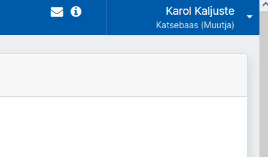
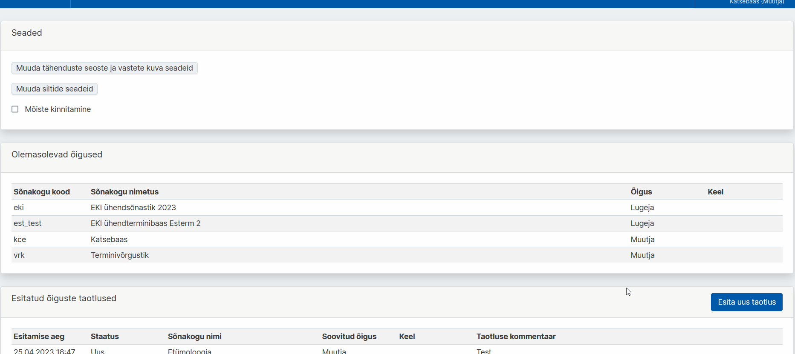
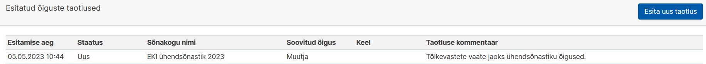
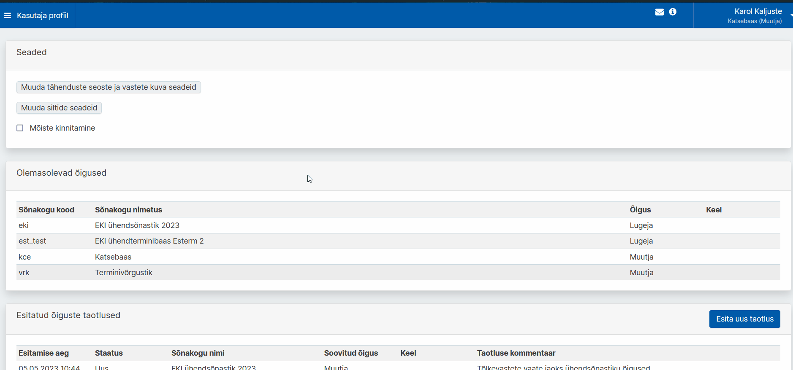
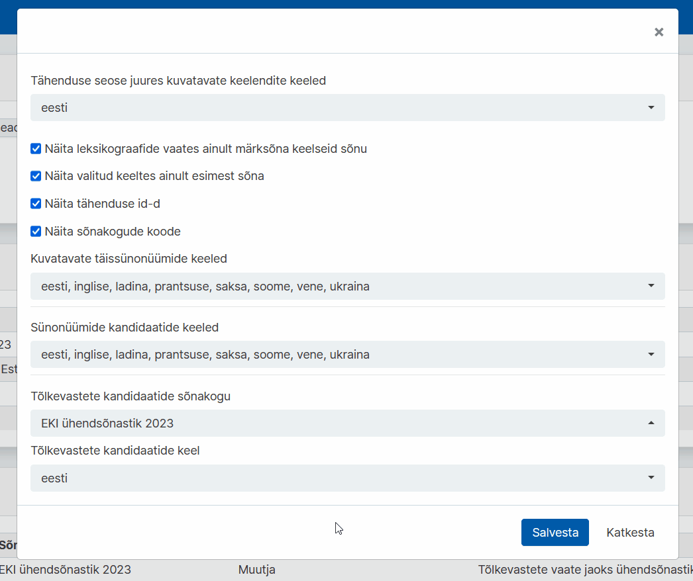

# Ekilexi kasutusjuhend

<button>[Avaleht](/index.md)</button>
<button>[Terminitöö sõnakoguga](/terminitoo.md)</button>

## Tõlkevastete vaate juhend

### Sisukord
...

---
### Seadistus

Et kasutada Tõlkevastete vaadet, peab kõigepealt kindlaks tegema, et kasutaja seadistus on korrektne.

---

#### Ühendsõnastiku ?

Kõigepealt on vajalik, et teil oleks olemas **EKI Ühendsõnastiku** muutmisõigus kõigis keeltes, või vähemalt eesti keeles ja võõrkeeles mida tõlkevastete vaates kasutate.

Selle puudumisel lihtsaim on taotleda kõigis keeltes sõnakogu muutmisõigust.

1. Klõpsake üleval sinise riba paremal pool oma nimele ja avage **"Kasutaja profiili haldus"**.  
   
    Pilt: Kasutaja klõpsamisel ilmuv rippmenüü

2. Profiilihalduse lehel, **"Esitatud õiguste taotlused"** all, on sinine nupp **"Esita uus taotlus"**. Sellele klõpsates avaneb taotluse saatmise aken. Vali **"EKI Ühendsõnastik 2023"** ja soovitud õiguseks **"Muutja"**. Jäta valitud keel lahter samaks, et seal oleks **"Kõik keeled"**. Lisa ka **põhjendus**, miks soovite sellele sõnakogule ligipääsu. Seejärel vajuta **"Saada taotlus"**.  
  
    Pilt: Taotluse akna avamine ja täitmine

3. Taotluse info on näha **"Esitatud õiguste taotlused"** all.  
   
    Pilt: Esitatud taotluse info tabelis

<!-- testida, et kas ainult lugemisõigusega saab ka tõlkevastete vaadet kasutada? hetkel laivis saab kui workaroundi kasutada lmao-->
Ekilexi administraator(?) kinnitab su taotluse (ajaperiood) jooksul.

---

#### Kasutaja seadistus

Järgmiseks peab kontrollima ?

1. Klõpsake üleval sinise riba paremal pool oma nimele ja avage **"Kasutaja profiili haldus"**.  
   
    Pilt: Kasutaja klõpsamisel ilmuv rippmenüü

2. Profiilihalduse lehel **"Seaded"** all on nupp **"Muuda tähenduste seoste ja vastete kuva seadeid"**, klõpsake sellel. Avaneb uus aken.
   
    Pilt: Tähenduste seoste ja vastete kuva seadete menüü avamine

3. Tõlkevastete vaate jaoks olulised on siin viimased kaks rippmenüüd. Valige **"Tõlkevastete kandidaatide sõnakogu"** alt kindel sõnakogu, mis teile vastete kandidaate varustama peaks, <!-- on juhendaja vms poolt antud-->ning **"Tõlkevastete kandidaatide keel"** alt mis keeles vasted olema hakkavad. Vajutage **"Salvesta"**.
   
    Pilt: Menüü lõpus kahe rippmenüü sees vastava valiku tegemine

<!-- kas vaja teha ka sünonüümide jaoks seadistuse ülevaat, et kuidas seadistus vaadet mõjutab(nähtaval vaid valitud keelte sünonüümid, ka tõlkevastete vaates)-->

---

### Tõlkevastete tööprotssess ?

---

#### Otsing

---

#### Vastekandidaadi... noh mida need nupud teevad
Märgi mittetegeletuks
Märgi kinnitatuks
Kustuta
see slider??
see graafiku asi??

---

#### Vastekandidaatide lisamine mõistekirjesse
1. lohistamine.

2. mis see vali sobiv keelend/loo uus(homonüüm) vahe on

mis NENDEL KAHEL vahet on.

##### Vastekandidaadi muutmine mõistekirjes
vaste kaalu muutmine
vaste detailsuse muutmine
kustutamine (et see ei eemalda vastekandidaatide reast seda)
liigutamine 

---

#### Uue vastekandidaadi lisamine
lic saab täiesti niisama ükskõik mis sõna lisada?
Kirjeldada et see on vist ühine üle süsteemi mitte kasutajapõhine?
