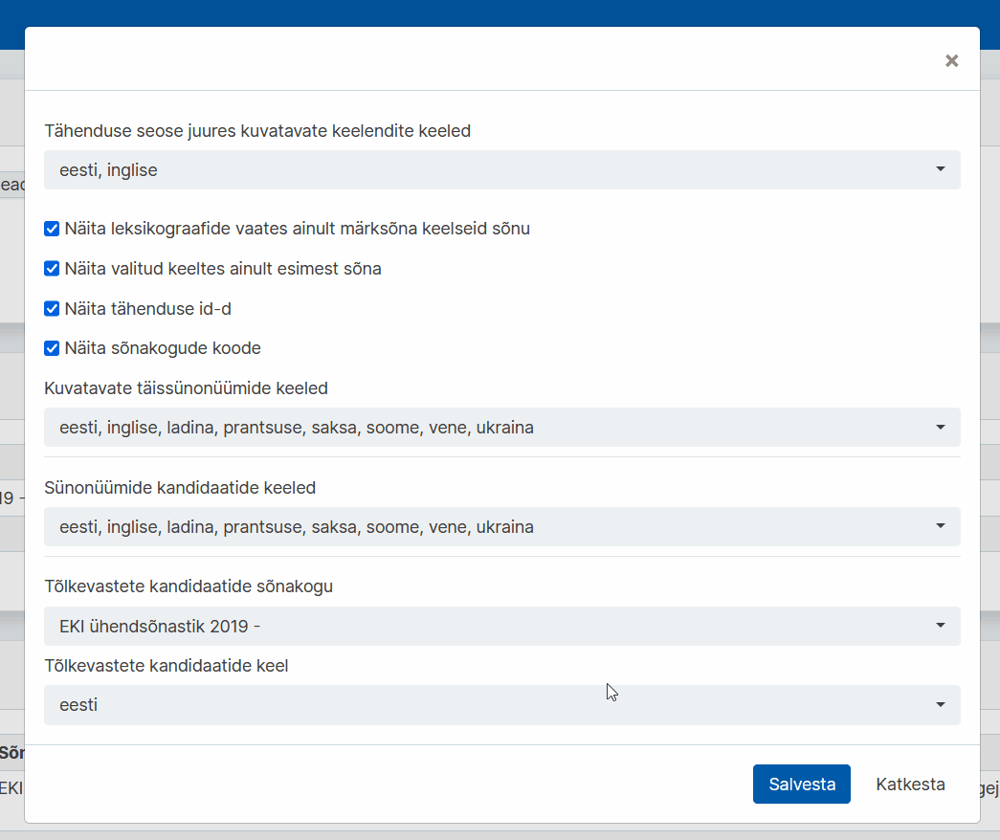
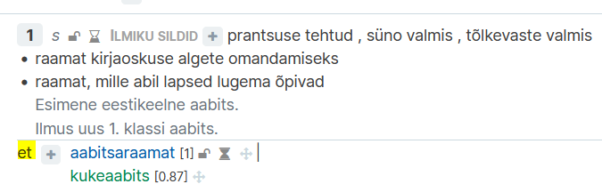

# Ekilexi kasutusjuhend

<button>[Avaleht](/index.md)</button>
<button>[Terminitöö sõnakoguga](/terminitoo.md)</button>

## Tõlkevastete vaate juhend

### Sisukord
...

---
### Seadistus

Et kasutada Tõlkevastete vaadet, peate kõigepealt kindlaks tegema, et kasutaja seadistus on korrektne.

---

#### Ühendsõnastiku ?

Kõigepealt on vajalik, et teil oleks olemas **EKI Ühendsõnastiku** muutmisõigus **kõigis keeltes**, või vähemalt eesti keeles ja võõrkeeles mida tõlkevastete vaates kasutate.

Selle puudumisel on lihtsaim taotleda kõigis keeltes sõnakogu muutmisõigust.

1. Klõpsake üleval sinise riba paremal pool oma nimele ja avage **"Kasutaja profiili haldus"**.  
   
    Pilt: Kasutaja klõpsamisel ilmuv rippmenüü

2. Profiilihalduse lehel, **"Esitatud õiguste taotlused"** all, on sinine nupp **"Esita uus taotlus"**. Sellele klõpsates avaneb taotluse saatmise aken. Vali **"EKI Ühendsõnastik 2023"** ja soovitud õiguseks **"Muutja"**. Jätke valitud keel lahter samaks, et seal oleks **"Kõik keeled"**. Lisage ka **põhjendus**, miks soovite sellele sõnakogule ligipääsu. Seejärel vajutage **"Saada taotlus"**.  
  
    Pilt: Taotluse akna avamine ja täitmine

3. Taotluse info on nüüd näha **"Esitatud õiguste taotlused"** all.  
   
    Pilt: Esitatud taotluse info tabelis

Ekilexi administraator(?) kinnitab teie taotluse (ajaperiood) jooksul.

---

#### Kasutaja seadistus

Järgmiseks peab kontrollima ?

1. Klõpsake üleval sinise riba paremal pool oma nimele ja avage **"Kasutaja profiili haldus"**.  
   
    Pilt: Kasutaja klõpsamisel ilmuv rippmenüü

2. Profiilihalduse lehel **"Seaded"** all on nupp **"Muuda tähenduste seoste ja vastete kuva seadeid"**, klõpsake sellel. Avaneb uus aken.
   
    Pilt: Tähenduste seoste ja vastete kuva seadete menüü avamine

3. Tõlkevastete vaate jaoks olulised on siin viimased kaks rippmenüüd. Valige **"Tõlkevastete kandidaatide sõnakogu"** alt kindel sõnakogu, mis teile vastete kandidaate varustama peaks, <!-- on juhendaja vms poolt antud-->ning **"Tõlkevastete kandidaatide keel"** alt mis keeles vasted olema hakkavad. Vajutage **"Salvesta"**.
   
    Pilt: Menüü lõpus kahe rippmenüü sees vastava valiku tegemine

"Tõlkevastete kandidaatide sõnakogu" all valitud sõnakogu(näites "Inglise vasted") õiguseid ei ole vaja taotleda, et teha tööd Tõlkevastete vaates.

Kui on aga tahe näha vastete sõnakogu näiteks Leksikograafide või Terminoloogide vaate otsingutulemuste seas, tuleks taotleda kindla sõnakogu lugemis- või muutmisõigus.

---

#### Sünonüümid?
<!-- kas vaja teha ka sünonüümide jaoks seadistuse ülevaat, et kuidas seadistus vaadet mõjutab(nähtaval vaid valitud keelte sünonüümid, ka tõlkevastete vaates) Panna küll!-->
Järgnev hõlmab küll algselt Sünonüümide vaadet, aga seaded mõjutavad väljanägemist(?) üle kogu süsteemi.

Kui seadeid mitte muuta, näevad mõisterkirjega ühendatud sünonüümid ja sõnavasted välja sellised, iga saadaval oleva keele omad on nähtaval.

Kui aga muuta ??

Miks siit en ära kadus. am i going insane. katseta teine päev uuesti??

---

### Tõlkevastete tööprotssess ?
Mitmekeelse sõnakogu koostamine toimub eelnevalt leitud vastekandidaatide alusel. Ekilexi on kindlasse sõnakogusse lisatud vastekandidaadid, mida kuvatakse tõlkevastete vaates ja nende kandidaatide kohta tuleb teha otsus, kas nad sobivad eestikeelsete märksõnade vasteks või mitte. 

kitsama ja laiema erinevuse kirjeldamine ?
Kitsama või laiema tähenduse märkimine: SÕnade tähendusväljad eri keeltes erinevad
poegima - inglise keeles pole, aga iga looma kohta on eri sõnad(), inglise tähendused on kitsama tähendusega, kuna käivad spetsiifilisema asja kohta
poegima on laiem tähendus
Kristina aitab läbi närida.

kuidas koostada sõnastiku artiklit, 
- otsin eesti märksõna, 
- vaatan üle teiskeelsed vastekandidaadid(mis peaks ilmuma), 
- lohistan sõna õige termini(?) alla, 
- tuleb ette aken kus saan kas valida vastava termini/seletuse, või luua uue homonüümi.

---

#### Otsing

Tõlkevastete vaate otsing ja detailotsing funktsioneerivad samaviisi, kui teistes vaadetes. Lugege lähemalt [siit](/terminitoo.md#terminite-otsing).

---

#### Vastekandidaadi... noh mida need nupud teevad
Märgi mittetegeletuks
Märgi kinnitatuks
Kustuta
see slider??
see graafiku asi??

---

#### Vastekandidaatide lisamine mõistekirjesse
1. lohistamine.

2. mis see vali sobiv keelend/loo uus(homonüüm) vahe on

mis NENDEL KAHEL vahet on.

##### Vastekandidaadi muutmine mõistekirjes
vaste kaalu muutmine
vaste detailsuse muutmine
kustutamine (et see ei eemalda vastekandidaatide reast seda)
liigutamine 

---

#### Uue vastekandidaadi lisamine
lic saab täiesti niisama ükskõik mis sõna lisada?
Kirjeldada et see on vist ühine üle süsteemi mitte kasutajapõhine?
