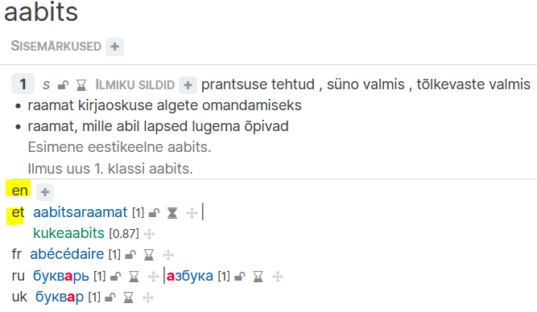
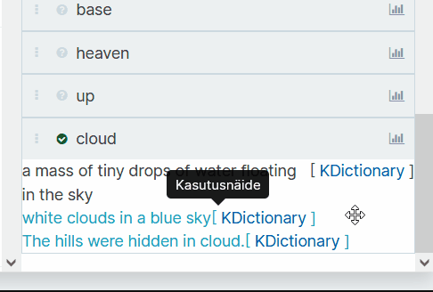
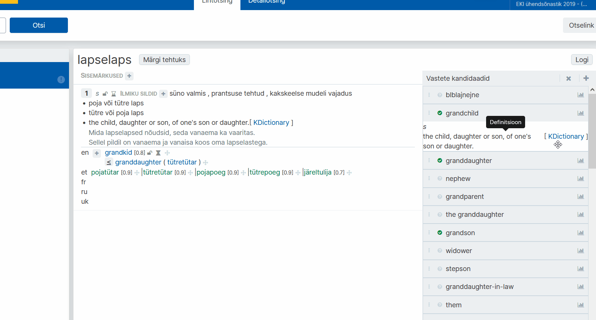
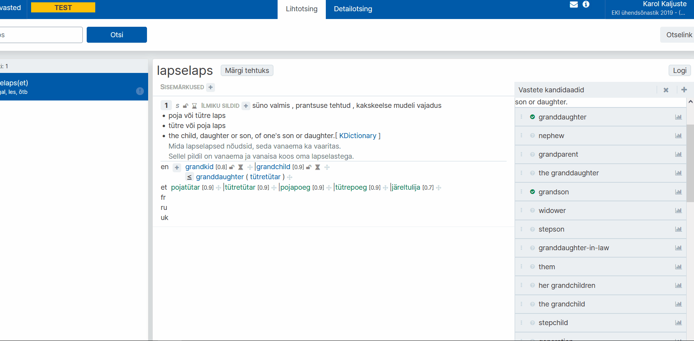

# Ekilexi kasutusjuhend

<button>[Avaleht](/index.md)</button>
<button>[Terminitöö sõnakoguga](/terminitoo.md)</button>

## Tõlkevastete vaate juhend

### Sisukord
...

---
### Seadistus

Et kasutada Tõlkevastete vaadet, peate kõigepealt kindlaks tegema, et kasutaja seadistus on korrektne.

---

#### Ekilexi muutmisõiguste seadistus

Kõigepealt on vajalik, et teil oleks olemas **EKI Ühendsõnastiku** muutmisõigus **kõigis keeltes**, või vähemalt eesti keeles ja võõrkeeles mida tõlkevastete vaates kasutate.

Selle puudumisel on lihtsaim taotleda kõigis keeltes sõnakogu muutmisõigust.

1. Klõpsake üleval sinise riba paremal pool oma nimele ja avage **"Kasutaja profiili haldus"**.  
   
    <!--Pilt: Kasutaja klõpsamisel ilmuv rippmenüü-->

2. Profiilihalduse lehel, **"Esitatud õiguste taotlused"** all, on sinine nupp **"Esita uus taotlus"**. Sellele klõpsates avaneb taotluse saatmise aken. Vali **"EKI Ühendsõnastik 2023"** ja soovitud õiguseks **"Muutja"**. Jätke valitud keel lahter samaks, et seal oleks **"Kõik keeled"**. Lisage ka **põhjendus**, miks soovite sellele sõnakogule ligipääsu. Seejärel vajutage **"Saada taotlus"**.  
  
    <!--Pilt: Taotluse akna avamine ja täitmine-->

3. Taotluse info on nüüd näha **"Esitatud õiguste taotlused"** all.  
   
    <!--Pilt: Esitatud taotluse info tabelis-->

Ekilexi administraator kinnitab teie taotluse mõne aja jooksul.

---

#### Kasutajaliidese seadistus

Järgmiseks peate seadistama tõlkevastete vaate-spetsiifilised seaded?
<!--???????????????????????-->

1. Klõpsake üleval sinise riba paremal pool oma nimele ja avage **"Kasutaja profiili haldus"**.  
   
    <!--Pilt: Kasutaja klõpsamisel ilmuv rippmenüü-->

2. Profiilihalduse lehel **"Seaded"** all on nupp **"Muuda tähenduste seoste ja vastete kuva seadeid"**, klõpsake sellel. Avaneb uus aken.
   
    <!--Pilt: Tähenduste seoste ja vastete kuva seadete menüü avamine-->

3. Tõlkevastete vaate jaoks olulised on siin viimased kaks rippmenüüd. Valige **"Tõlkevastete kandidaatide sõnakogu"** alt kindel sõnakogu, mis teile vastete kandidaate varustama peaks, <!-- on juhendaja vms poolt antud-->ning **"Tõlkevastete kandidaatide keel"** alt mis keeles vasted olema hakkavad. Vajutage **"Salvesta"**.
   
    <!--Pilt: Menüü lõpus kahe rippmenüü sees vastava valiku tegemine-->

"Tõlkevastete kandidaatide sõnakogu" all valitud sõnakogu(näites "Inglise vasted") õiguseid ei ole vaja taotleda, et teha tööd Tõlkevastete vaates.

Kui on aga tahe näha vastete sõnakogu näiteks Leksikograafide või Terminoloogide vaate otsingutulemuste seas, tuleks taotleda kindla sõnakogu lugemis- või muutmisõigus.

---

#### Sünonüümid? kuidas seda paremini...?
Järgnev puudutab küll pigem Sünonüümide vaade tööd, aga seaded mõjutavad väljanägemist(?) üle kogu süsteemi.

Kui seadeid mitte muuta, näevad mõistekirjega ühendatud sünonüümid ja sõnavasted välja sellised. Iga saadaval oleva keele vasted on ekilexis mõistekirjes nähtaval.  
   
    <!--Pilt: ??-->

Kui aga valida Seadete alt "Muuda tähenduste seoste ja vastete kuva seadeid" aknast "Kuvatavate täissünonüümide keeled" alt vaid need keeled, mida kasutate tõlkevastete leidmisel,
   
    <!--Pilt: ??-->

Siis on näha vaid tööks valitud keelte vasted.  
   
    <!--Pilt: ??-->

---

#### Siltide seadistus

<!--????????????-->
Siltide lisamine või tõlkevaste tehtuks märkimine ei muuda funktsionaalsust. See aga annab teistele ekilexi kasutajatele teada, kuidas on terminitega tegeletud, või mida peaks kindla terminiga veel tegema. 

1. Klõpsake üleval sinise riba paremal pool oma nimele ja avage **"Kasutaja profiili haldus"**.  
   
    <!--Pilt: Kasutaja klõpsamisel ilmuv rippmenüü-->

2. Profiilihalduse lehel **"Seaded"** all on nupp **"Muuda siltide seadeid"**, klõpsake sellel. Avaneb uus aken. Sealt saate valida mõlemas rippmenüüs **"tõlkevaste valmis"**. Vajutage **"Salvesta"**.
   
    <!--Pilt: ??-->

Nüüd, kui olete lõpetanud töö tõlkevaste vaates, siis saate termini(?) märkida tehtuks.
   
    <!--Pilt: ??-->

Sama tulemuse saab ka, kui lisada **"ilmiku sildid"** juuresolevast plussmärgist sama silt.

---

### Tõlkevastete tööprotssess ???

Mitmekeelse sõnakogu koostamine toimub eelnevalt leitud vastekandidaatide alusel. Ekilexi on kindlasse sõnakogusse lisatud vastekandidaadid, mida kuvatakse otsitud termini alusel tõlkevastete vaates paremas tulbas. Nende kandidaatide kohta tuleb teha otsus, kas nad sobivad eestikeelsete märksõnade vasteks või mitte.  
   
    <!--Pilt: ??-->
Samuti on vaja otsustada, kas tõlkevaste on terminiga võrdne, või on vaja lisada see laiema või kitsama vastena.

(
kuidas koostada sõnastiku artiklit, 
- otsin eesti märksõna, 
- vaatan üle teiskeelsed vastekandidaadid(mis peaks ilmuma), 
- lohistan sõna õige termini(?) alla, 
- tuleb ette aken kus saan kas valida vastava termini/seletuse, või luua uue homonüümi.
)
---

#### Otsing

Tõlkevastete vaate otsing ja detailotsing funktsioneerivad samaviisi/samamoodi?, kui teistes vaadetes. Lugege lähemalt [siit](/terminitoo.md#terminite-otsing).

??otsisõna, kõik tähendused, otsisõna kandidaadid, tulevad automaatselt nimekirjast.

---

#### Võrdse vastekandidaadi lisamine mõistekirjesse

1. Avage töölaual link **"Tõlkevasted"**.

2. **Sisestage otsisõna**. Kasutada võite **metamärke**. Vajutage **"Otsi"**.

3. Valige paremal vastekandidaatide tulbast sobiv vaste, ning lohistage hiirenuppu all hoides see õige termini juurde. Mõnel vastekandidaadil võib olla näha inglise keelne kirjeldus ja selle allikas.

    a. Kui valitud vaste **ei esine** homonüümina üheski olemasolevas sõnakogus, siis lisandub see ?????????? kogusse? tee selgeks  
   
    <!--Pilt: ??-->

    b. Kui sisestatud keelend **juba esineb** olemasolevas sõnakogus, kuvab süsteem teile sama kujuga keelendid ja nende kirjed, mis on teistesse sõnastikesse ja terminibaasidesse lisatud.  
Tehke linnuke selle tähendusega keelendi ette, mis sarnaneb teie omaga enim.  
   
    <!--Pilt: ??-->

    c. Kui ükski neist ei sarnane, saate teha keelendi ka uueks homonüümiks.  
   
    <!--Pilt: ??-->

Mõte on, et ei tekitaks juurde uusi homonüüme ilmaasjata. ??Paremini sõnastada.

Vastekandidaatide tulbas, keelendi juures oleva graafiku ikooni peale minnes, on näha vastekandidaadi kaal. Mida suurem number, seda usaldusväärsemast allikast on see pärit. Kõrgem number on sõnaraamatutest ja terminikogudest pärinevatel keelenditel, madalam aga nendel, mis on tõlkemäludest ja keelekorpustest. ???  
   
    <!--Pilt: ??-->

Samuti saab lisada vastekandidaate vastava keele lühendi kõrvalt plussmärki vajutades. Selle tagajärjel avaneb sarnane aken keelendi valimiseks või uue homonüümi andmiseks, aga siinkohal eelneb sellele otsingu teostamine.  
   
    <!--Pilt: ??-->

---

##### Vastekandidaadi muutmine mõistekirjes

Kui tõlkevasteid on juba lisatud, saab neid mõistekirjes ka muuta.

Liikudes hiirega tõlkevaste peale, saate vajutada ruuduga ümbritsetud pliiatsi ikoonile, misjärel avaneb vaste kaalu muutmise aken. Selles saate muuta komaga arvu, et suurendada või vähendada vaste kaalu. See ei ilmu sõnvaveebis ja on vaid süsteemisisene märge/muutuja(???).
   
    <!--Pilt: ??-->

Liikudes hiirega tõlkevaste peale, saate vajutada allasuunavale/näitavale noole ikoonile, mis avab rippmenüü vaste lihtsuse muutmise jaoks. "Lihtne" ja "Lihtne/Detailne" märgiga vasted on nähtaval keeleõppija sõnaveebis, "Detailne" märgiga aga mitte(kas sain õigesti aru??).
   
    <!--Pilt: ??-->

Liikudes hiirega tõlkevaste peale, saate vajutada kollasele x nupule, et kustutada vaste selle termini alt. See toiming ei kustuta vastet parempoolsest vastekandidaatide reast.
   
    <!--Pilt: ??-->

Liikudes hiirega tõlkevaste peale, saate lõpus oleva ristnoolte(???) ikooni peal vajutades ja lohistades liigutada vastet, et muuta sõnade ilmumise järjekorda sõnaveebis. 
   
    <!--Pilt: ??-->

---

#### Vastekandidaadi nupufunktsioonid (??)

Paremas tulbas iga vastekandidaadi juures on sünonüümivaatest üle kantud nupud. 
Nendega saab märkida vaste mittetegeletuks, kinnitatuks või kustutatuks(lükata nimekirja lõppu). Tõlkevastete vaates nendel hetkel funktsionaalsus puudub, kuna sõnakogu on mitteavalik, ning ei ilmu sõnaveebis.  
   
    <!--Pilt: ??-->

Ainus oluline nupp siin on hall lüliti, mille kasutus on kirjeldatud järgmises peatükis.
   
    <!--Pilt: ??-->

---

#### Laiema/kitsama lisamine

##### Seletama mis laiema kitsama vahe on. võtta üks näide mis kristina mulle andis ja sellega läbi teha.
näide tavalisest tõstmisest

1.

2.

3.

kitsama ja laiema erinevuse kirjeldamine ?
Kitsama või laiema tähenduse märkimine: SÕnade tähendusväljad eri keeltes erinevad
poegima - inglise keeles pole, aga iga looma kohta on eri sõnad(), inglise tähendused on kitsama tähendusega, kuna käivad spetsiifilisema asja kohta
poegima on laiem tähendus
Kristina aitab läbi närida.

vaata koosoleku märkmeid et kirjeldada

peab toggle switchi aktiveerima
siis lohistama, tuleb uus aken
siis enter/sisestama eestikeelne vaste? või sama sõna?
saab lisada lühivihje, kuidas see on seotud teise sõnaga
valida tähendused, mingi jama ka sellega?
valida kumb on kitsam kumb laiem

näitab selle suurem/väiksem võrdne märgiga termini all, kumb on

---

##### Uue vastekandidaadi lisamine
Võib juhtuda, et kandidaatide all ei ole ühtegi vastet.
saab lisada otse termini(?) all, seal see läheb aga kohe otsevasteks
saab lisada paremal tulba kohal sõna, mis teeb selle vastekandidaadiks, mida saab switchiga muuta, et kas lisad selle otsevasteks või kitsam/laiem vasteks

kui pole kandidaatide all olemas vastet, siis saab ise lisada. soovitatav kasutada seda mis on paremal üleval, kuna see mis on sõna juures, sealt saab lisada ainult otsevasteid, mitte kitsamaid ja laiemaid

---

### ??

kui on sõna tehtud, siis vajutad nuppu märgi tehtuks. siis tekib tõlkevaste valmis silt. see on tööprotsessi jälgimise mõttes, et märkida kes mis kui palju teinud on.
see oli siis see miks seadetes selle sildi asja ära muutsime.
